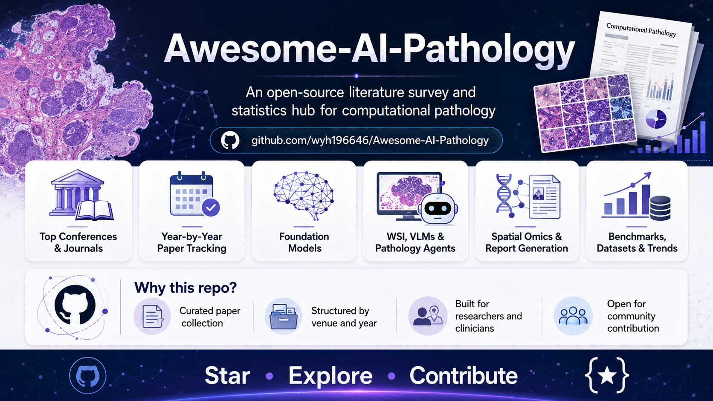

  

# Awesome-AI-Pathology
Awesome AI Pathology papers, including top AI conferences and journals such as CVPR, ICCV, ECCV, NeurIPS, ICML, ICLR, ACM MM, MICCAI, MIDL, Nature, Nature Medicine, Nature Methods, Nature Biomedical Engineering, npj Digital Medicine, The Lancet Digital Health, Medical Image Analysis, and IEEE Transactions on Medical Imaging.

## Highlights

- 📚 500+ curated papers in computational pathology
- 🧠 Foundation models, WSI analysis, VLMs, agents, and spatial omics
- 🏛️ Top conferences and journals: CVPR, ICCV, NeurIPS, ICML, ICLR, MICCAI, MIDL, Nature, Cell, Lancet, IEEE TMI, MedIA
- 📊 Year-by-year and venue-by-venue paper tracking
- 🔎 Tags for tasks, diseases, modalities, and model types
- 🤝 Open for community contributions

## Surveyed Venue List
The following venues were included in the collection and screening scope. Some venues may not yet have confirmed computational-pathology papers for every year.

**Computer Vision / Machine Learning / AI Conferences**
- ACM MM / ACMMM
- AAAI
- CVPR
- ECCV
- ICCV
- ICML
- ICLR
- IJCAI
- NeurIPS
- The Web Conference / WWW
- WACV
- MICCAI
- MIDL
- ML4H

**Computer Science / Medical AI Journals**
- IEEE Transactions on Medical Imaging
- IEEE Journal of Biomedical and Health Informatics
- Medical Image Analysis
- Pattern Recognition
- International Journal of Computer Vision
- Computers in Biology and Medicine
- Artificial Intelligence in Medicine
- Computerized Medical Imaging and Graphics
- IEEE Transactions on Pattern Analysis and Machine Intelligence
- IEEE Transactions on Neural Networks and Learning Systems

**Nature / Cell / Lancet / Biomedical Journals**
- Nature
- Nature Medicine
- Nature Cancer
- Nature Methods
- Nature Machine Intelligence
- Nature Communications
- Nature Biomedical Engineering
- Communications Medicine
- npj Digital Medicine
- npj Precision Oncology
- npj Imaging
- Scientific Data
- Scientific Reports
- Cell
- Cancer Cell
- The Lancet Digital Health
- The Lancet Oncology
- eBioMedicine
- JAMA Dermatology
- Nucleic Acids Research
- Advanced Science
- Light: Science & Applications

**Preprints / Technical Reports**
- arXiv
- bioRxiv
- TechRxiv

## Table of Contents

- [Surveyed Venue List](#surveyed-venue-list)
- [AI in Pathology](#papers)

# Papers

# 2026

**Nature**
- Clinical-grade autonomous cytopathology through whole-slide edge tomography [[paper](https://www.nature.com/articles/s41586-025-10094-y)]

**Nature Medicine**
- AI-enabled virtual spatial proteomics from histopathology for interpretable biomarker discovery in lung cancer [[paper](https://www.nature.com/articles/s41591-025-04060-4)]
- An agentic framework for autonomous scientific discovery in cancer pathology [[paper](https://www.nature.com/articles/s41591-026-04357-y)]

**Nature Cancer**
- Harnessing foundation models for digital pathology without re-training [[paper](https://www.nature.com/articles/s43018-025-01108-9)]

**Nature Methods**
- Systematically decoding pathological morphologies and molecular profiles with unified multimodal embedding [[paper](https://www.nature.com/articles/s41592-026-03070-5)]
- PRET is a few-shot system for pan-cancer recognition without example training [[paper](https://www.nature.com/articles/s43018-026-01141-2)]
- The automated computational workflow QUICHE reveals structural definitions of antitumor responses in triple-negative breast cancer [[paper](https://www.nature.com/articles/s43018-026-01122-5)]
- Temporal and spatial composition of the tumor microenvironment predicts response to immune checkpoint inhibition in metastatic TNBC [[paper](https://www.nature.com/articles/s43018-026-01114-5)]
- LazySlide: accessible and interoperable whole-slide image analysis [[paper](https://www.nature.com/articles/s41592-026-03044-7)]

**Nature Communications**
- Boosting pathology foundation models via few-shot prompt-tuning for rare cancer subtyping [[paper](https://www.nature.com/articles/s41467-026-71715-2)]
- Generative AI for misalignment-resistant virtual staining to accelerate histopathology workflows [[paper](https://www.nature.com/articles/s41467-026-71038-2)]
- Meta-encoder: a unified integration framework for multiple pathological foundation models in cancer detection [[paper](https://www.nature.com/articles/s41467-026-71558-x)]
- KidRare [[paper](https://doi.org/10.1038/s41467-026-71715-2)][[dataset](https://huggingface.co/datasets/Firehdx233/KidRare)]
- STimage [[paper](https://doi.org/10.1038/s41467-026-68487-0)][[code](https://github.com/BiomedicalMachineLearning/STimage)]
- Gastric Early Recurrence [[paper](https://www.nature.com/articles/s41467-026-71347-6)]

**Nature Biomedical Engineering**
- A multimodal vision–language model for generalizable annotation-free pathology localization [[paper](https://www.nature.com/articles/s41551-025-01574-7)]
- Leveraging multi-modal foundation models for analysing spatial multi-omic and histopathology data [[paper](https://www.nature.com/articles/s41551-025-01602-6)]
- A Generalizable Pathology Foundation Model Using a Unified Knowledge Distillation Pretraining Framework [[paper](https://www.nature.com/articles/s41551-025-01488-4)]

**Communications Medicine**
- Comprehensive Evaluation of Cross Cancer Generalization in Histopathology Segmentation Models Across 21 Tumor Types [[paper](https://www.nature.com/articles/s43856-026-01601-x)]

**npj Digital Medicine**
- OncoPT: long-context transformer models for in hospital tumor phenotype extraction from pathology reports [[paper](https://www.nature.com/articles/s41746-026-02630-5)]
- Structure-aware generalization for heterogeneous histopathology via prototype-based multiple instance learning [[paper](https://www.nature.com/articles/s41746-025-02289-4)]
- Subspecialty-Specific Foundation Model for Intelligent Gastrointestinal Pathology [[paper](https://www.nature.com/articles/s41746-026-02684-5)]
- High-sensitivity Pan-cancer AI Assessment of Lymph Node Metastasis via Uncertainty Quantification [[paper](https://www.nature.com/articles/s41746-026-02564-y)]
- Deep Learning for Malignancy and Tumor Origin Prediction Using Cytology or Histopathology Whole Slide Images [[paper](https://www.nature.com/articles/s41746-026-02359-1)]
- Melan-Dx: A Knowledge-enhanced Vision-language Framework Improves Differential Diagnosis of Melanocytic Neoplasm Pathology [[paper](https://www.nature.com/articles/s41746-026-02357-3)]
- Patch-to-slide Fusion Deep Learning Model for Histological Diagnosis of Early Pregnancy Loss Including Hydatidiform Mole [[paper](https://www.nature.com/articles/s41746-026-02628-z)]
- An Evaluation of Artificial Intelligence Assisted Prostate Biopsy Reporting in the Articulate Pro Study [[paper](https://www.nature.com/articles/s41746-026-02592-8)]
- Distinction Between Primary and Metastatic Mucinous Ovarian Carcinoma from Histopathology Images Using Deep Learning [[paper](https://www.nature.com/articles/s41746-026-02459-y)]
- Soft Multiclass Feature Augmented Deep Learning to Predict Tumor Origins Using Cytology or Histology Whole Slide Images [[paper](https://www.nature.com/articles/s41746-026-02604-7)]
- Geometric multi-instance learning for weakly supervised gastric cancer segmentation [[paper](https://www.nature.com/articles/s41746-025-02287-6)]
- A human-in-the-loop explanation framework for morphologically transparent AI predictions from whole-slide images [[paper](https://www.nature.com/articles/s41746-026-02741-z)]

**npj Precision Oncology**
- Real-world Benchmarking and Validation of Foundation Model Transformers for Endometrial Cancer Subtyping from Histopathology [[paper](https://www.nature.com/articles/s41698-026-01402-4)]
- The Next Layer: Augmenting Foundation Models with Structure-preserving and Attention-guided Learning for Local Patches to Global Context Awareness in Computational Pathology [[paper](https://www.nature.com/articles/s41698-026-01312-5)]

**Scientific Data**
- STHELAR, a Multi-tissue Dataset Linking Spatial Transcriptomics and Histology for Cell Type Annotation [[paper](https://www.nature.com/articles/s41597-026-06937-6)]
- Malignant vs. non-malignant annotations on TCGA breast tumor whole slide images [[paper](https://www.nature.com/articles/s41597-026-07106-5)]

**Scientific Reports**
- Multimodal Survival Analysis of Glioblastoma Using Whole-slide Histopathology, Clinical, and Gene Expression Data [[paper](https://www.nature.com/articles/s41598-026-48666-1)]

**Cancer Cell**
- Knowledge-enhanced pretraining for vision-language pathology foundation model on cancer diagnosis [[paper](https://linkinghub.elsevier.com/retrieve/pii/S1535610826000589)]
- KEEP [[paper](https://www.cell.com/cancer-cell/fulltext/S1535-6108(26)00058-9)]

**Cell**
- AI-predicted spatial transcriptomics unlocks breast cancer biomarkers from pathology [[paper](https://linkinghub.elsevier.com/retrieve/pii/S0092867426004587)]

**Light: Science & Applications**
- Universal and Transferable Attacks on Pathology Foundation Models [[paper](https://www.nature.com/articles/s41377-026-02347-w)]

**Advanced Science**
- GloPath: An Entity‐Centric Foundation Model for Glomerular Lesion Assessment and Clinicopathological Insights [[paper](https://advanced.onlinelibrary.wiley.com/doi/10.1002/advs.202520580)]
- His‐MMDM: Multi‐Domain and Multi‐Omics Translation of Histopathological Images with Diffusion Models [[paper](https://advanced.onlinelibrary.wiley.com/doi/10.1002/advs.202518066)]

**Medical Image Analysis**
- CLIP-Guided Generative network for pathology nuclei image augmentation [[paper](https://linkinghub.elsevier.com/retrieve/pii/S1361841525004542)]
- Diagnostic text-guided representation learning in hierarchical classification for pathological whole slide image [[paper](https://linkinghub.elsevier.com/retrieve/pii/S1361841525004402)]
- Efficient self-supervised Barlow Twins from limited tissue slide cohorts for colonic pathology diagnostics [[paper](https://linkinghub.elsevier.com/retrieve/pii/S1361841526000733)]
- Towards generalizable pathology reports via a multimodal LLM with the multicenter in-context learning [[paper](https://linkinghub.elsevier.com/retrieve/pii/S1361841526001283)]
- MegaSeg: Towards Scalable Semantic Segmentation for Megapixel Images [[paper](https://doi.org/10.1016/j.media.2026.103933)]

**IEEE Transactions on Medical Imaging**
- Scan-invariant Mamba with Differentiated Sequence Contrastive Learning in Computational Pathology [[paper](https://doi.org/10.1109/TMI.2026.3668909)]

**IEEE Journal of Biomedical and Health Informatics**
- DiagR1: A Vision-Language Model Trained via Reinforcement Learning for Digestive Pathology Diagnosis [[paper](https://ieeexplore.ieee.org/document/11419719/)]
- Leveraging Vision-Language Embeddings for Zero-Shot Learning in Histopathology Images [[paper](https://doi.org/10.1109/JBHI.2025.3584802)]

**Pattern Recognition**
- Towards unified molecule-enhanced pathology image representation learning via integrating spatial transcriptomics [[paper](https://linkinghub.elsevier.com/retrieve/pii/S0031320325011215)]

**Computers in Biology and Medicine**
- MIPHEI-ViT: Multiplex Immunofluorescence Prediction from H&E Images Using ViT Foundation Models [[paper](https://doi.org/10.1016/j.compbiomed.2026.111564)]

**CVPR 2026** ✅
- From Spots to Pixels: Dense Spatial Gene Expression Prediction from Histology Images [[paper](https://openaccess.thecvf.com/content/CVPR2026/html/Zhang_From_Spots_to_Pixels_Dense_Spatial_Gene_Expression_Prediction_from_CVPR_2026_paper.html)]
- Predicting Spatial Transcriptomics from Histology Images via High-Order Multi-Cell Interaction Modeling [[paper](https://openaccess.thecvf.com/content/CVPR2026/html/Sun_Predicting_Spatial_Transcriptomics_from_Histology_Images_via_High-Order_Multi-Cell_Interaction_CVPR_2026_paper.html)]
- TopoSlide: Topologically-Informed Histopathology Whole Slide Image Representation Learning [[paper](https://openaccess.thecvf.com/content/CVPR2026/html/Abousamra_TopoSlide_Topologically-Informed_Histopathology_Whole_Slide_Image_Representation_Learning_CVPR_2026_paper.html)]
- Turning Pre-Trained Vision Transformers into End-to-End Histopathology Whole Slide Image Models for Survival Prediction [[paper](https://openaccess.thecvf.com/content/CVPR2026/html/Li_Turning_Pre-Trained_Vision_Transformers_into_End-to-End_Histopathology_Whole_Slide_Image_CVPR_2026_paper.html)]
- URICA: A Uniformity Region Affine Identifier Capture Algorithm for Arbitrary Region Retrieval in Pathology Images [[paper](https://openaccess.thecvf.com/content/CVPR2026/html/Su_URICA_A_Uniformity_Region_Affine_Identifier_Capture_Algorithm_for_Arbitrary_CVPR_2026_paper.html)]
- Act Like a Pathologist: Tissue-Aware Whole Slide Image Reasoning [[paper](https://openaccess.thecvf.com/content/CVPR2026/html/Huang_Act_Like_a_Pathologist_Tissue-Aware_Whole_Slide_Image_Reasoning_CVPR_2026_paper.html)]
- Momentum Memory for Knowledge Distillation in Computational Pathology [[paper](https://openaccess.thecvf.com/content/CVPR2026/html/Guo_Momentum_Memory_for_Knowledge_Distillation_in_Computational_Pathology_CVPR_2026_paper.html)]
- Universal-to-Specific Dynamic Knowledge-Guided Multiple Instance Learning for Few-Shot Whole Slide Image Classification [[paper](https://openaccess.thecvf.com/content/CVPR2026/html/Li_Universal-to-Specific_Dynamic_Knowledge-Guided_Multiple_Instance_Learning_for_Few-Shot_Whole_Slide_CVPR_2026_paper.html)]
- CARE: A Molecular-Guided Foundation Model with Adaptive Region Modeling for Whole Slide Image Analysis [[paper](https://openaccess.thecvf.com/content/CVPR2026/html/Zhang_CARE_A_Molecular-Guided_Foundation_Model_with_Adaptive_Region_Modeling_for_CVPR_2026_paper.html)]
- FBTA: Enabling Single-GPU End-to-End Gigapixel Whole Slide Image Classification with Feature Bridging and Translation Alignment  [[paper](https://openaccess.thecvf.com/content/CVPR2026/papers/Dong_FBTA_Enabling_Single-GPU_End-to-End_Gigapixel_WSI_Classification_with_Feature_Bridging_CVPR_2026_paper.pdf)]
- Beyond Pixel Simulation: Pathology Image Generation via Diagnostic Semantic Tokens and Prototype Control [[paper](https://openaccess.thecvf.com/content/CVPR2026/html/Han_Beyond_Pixel_Simulation_Pathology_Image_Generation_via_Diagnostic_Semantic_Tokens_CVPR_2026_paper.html)]
- Adapting a Pre-trained Single-Cell Foundation Model to Spatial Gene Expression Generation from Histology Images [[paper](https://openaccess.thecvf.com/content/CVPR2026/html/Fang_Adapting_a_Pre-trained_Single-Cell_Foundation_Model_to_Spatial_Gene_Expression_CVPR_2026_paper.html)]
- WSI-LLaVA: A Multimodal Large Language Model for Hierarchical Whole Slide Image Understanding [[paper](https://openaccess.thecvf.com/content/CVPR2026/html/Alawode_MLLM-HWSI_A_Multimodal_Large_Language_Model_for_Hierarchical_Whole_Slide_CVPR_2026_paper.html)]
- Dual-Level Hypergraph Generation for Addressing Feature Scarcity in Whole-Slide Image Classification [[paper](https://openaccess.thecvf.com/content/CVPR2026/html/Yao_Dual-Level_Hypergraph_Generation_for_Addressing_Feature_Scarcity_in_Whole-Slide_Image_CVPR_2026_paper.html)]
- FBTA: Enabling Single-GPU End-to-End Gigapixel WSI Classification with Feature Bridging and Translation Alignment [[paper](https://openaccess.thecvf.com/content/CVPR2026/html/Dong_FBTA_Enabling_Single-GPU_End-to-End_Gigapixel_WSI_Classification_with_Feature_Bridging_CVPR_2026_paper.html)]
- SAR2Net: Learning Spatially Anchored Representations for Retrieval-Guided Cross-Stain Alignment [[paper](https://openaccess.thecvf.com/content/CVPR2026/html/Shen_SAR2Net_Learning_Spatially_Anchored_Representations_for_Retrieval-Guided_Cross-Stain_Alignment_CVPR_2026_paper.html)]
- Bridging RGB and Hematoxylin Components: An Interleaved Guidance and Fusion Framework for Point Supervised Nuclei Segmentation [[paper](https://openaccess.thecvf.com/content/CVPR2026/html/Huan_Bridging_RGB_and_Hematoxylin_Components_An_Interleaved_Guidance_and_Fusion_CVPR_2026_paper.html)]
- MUSE: Harnessing Precise and Diverse Semantics for Few-Shot Whole Slide Image Classification [[paper](https://openaccess.thecvf.com/content/CVPR2026/html/Xu_MUSE_Harnessing_Precise_and_Diverse_Semantics_for_Few-Shot_Whole_Slide_CVPR_2026_paper.html)]
- H2-Surv: Hierarchical Hyperbolic Multimodal Representation Learning for Survival Prediction [[paper](https://openaccess.thecvf.com/content/CVPR2026/html/Yang_H2-Surv_Hierarchical_Hyperbolic_Multimodal_Representation_Learning_for_Survival_Prediction_CVPR_2026_paper.html)]
- MuViT: Multi-Resolution Vision Transformers for Learning Across Scales in Microscopy [[paper](https://openaccess.thecvf.com/content/CVPR2026/html/Mantes_MuViT_Multi-Resolution_Vision_Transformers_for_Learning_Across_Scales_in_Microscopy_CVPR_2026_paper.html)]
- Cell-Type Prototype-Informed Neural Network for Gene Expression Estimation from Pathology Images [[paper](https://openaccess.thecvf.com/content/CVPR2026/html/Nishimura_Cell-Type_Prototype-Informed_Neural_Network_for_Gene_Expression_Estimation_from_Pathology_CVPR_2026_paper.html)]
- KAMP: Knowledge-Anchored Multimodal Pretraining Framework for Medical Image Representation [[paper](https://openaccess.thecvf.com/content/CVPR2026/html/Huang_KAMP_Knowledge-Anchored_Multimodal_Pretraining_Framework_for_Medical_Image_Representation_CVPR_2026_paper.html)]
- Advancing Cancer Prognosis with Hierarchical Fusion of Genomic, Proteomic and Pathology Imaging Data from a Systems Biology Perspective [[paper](https://openaccess.thecvf.com/content/CVPR2026/html/Zhou_Advancing_Cancer_Prognosis_with_Hierarchical_Fusion_of_Genomic_Proteomic_and_Pathology_CVPR_2026_paper.html)]
- Contrastive Cross-Bag Augmentation for Multiple Instance Learning-based Whole Slide Image Classification [[paper](https://openaccess.thecvf.com/content/CVPR2026/html/Zhang_Contrastive_Cross-Bag_Augmentation_for_Multiple_Instance_Learning-based_Whole_Slide_Image_Classification_CVPR_2026_paper.html)]
- Factorized Context Aggregation for Robust Cancer Risk Estimation via Soft Re-Ranked Retrieval and Hierarchical Anchors [[paper](https://openaccess.thecvf.com/content/CVPR2026/html/Moghadam_Factorized_Context_Aggregation_for_Robust_Cancer_Risk_Estimation_via_Soft_CVPR_2026_paper.html)]
- Cross-Slice Knowledge Transfer via Masked Multi-Modal Heterogeneous Graph Contrastive Learning for Spatial Gene Expression Inference [[paper](https://openaccess.thecvf.com/content/CVPR2026/html/Shi_Cross-Slice_Knowledge_Transfer_via_Masked_Multi-Modal_Heterogeneous_Graph_Contrastive_Learning_CVPR_2026_paper.html)]
- GeneVAR: Causal MeanFlow for Autoregressive Gene-to-WSI Tile Synthesis[[paper](https://openaccess.thecvf.com/content/CVPR2026/papers/Zhao_GeneVAR_Causal_MeanFlow_for_Autoregressive_Gene-to-WSI_Tile_Synthesis_CVPR_2026_paper.pdf)]
- HyperST: Hierarchical Hyperbolic Learning for Spatial Transcriptomics Prediction [[paper](https://openaccess.thecvf.com/content/CVPR2026/html/Zhang_HyperST_Hierarchical_Hyperbolic_Learning_for_Spatial_Transcriptomics_Prediction_CVPR_2026_paper.html)]
- Bulk RNA-seq Guided Multi-modal Detection of Anomalous Regions in Human Cancer via Spatial Transcriptomics [[paper](https://openaccess.thecvf.com/content/CVPR2026/html/Shi_Bulk_RNA-seq_Guided_Multi-modal_Detection_of_Anomalous_Regions_in_Human_CVPR_2026_paper.html)]
- MUST: Modality-Specific Representation-Aware Transformer for Diffusion-Enhanced Survival Prediction with Missing Modality[[paper](https://openaccess.thecvf.com/content/CVPR2026/papers/Kim_MUST_Modality-Specific_Representation-Aware_Transformer_for_Diffusion-Enhanced_Survival_Prediction_with_Missing_CVPR_2026_paper.pdf)]
- GeneVAR: A Causal Generative Framework for Gene-to-WSI Tile Synthesis[[paper](https://openaccess.thecvf.com/content/CVPR2026/papers/Zhao_GeneVAR_Causal_MeanFlow_for_Autoregressive_Gene-to-WSI_Tile_Synthesis_CVPR_2026_paper.pdf)]
- MDCS-MoAME: Multi-directional Composite Scanning with Mixture of Attention and Mamba Experts for Cancer Survival Prediction[[paper](https://openaccess.thecvf.com/content/CVPR2026/html/Qu_MDCS-MoAME_Multi-directional_Composite_Scanning_with_Mixture_of_Attention_and_Mamba_CVPR_2026_paper.html)]
- FEAST: Fully Connected Expressive Attention for Spatial Transcriptomics[[paper](https://openaccess.thecvf.com/content/CVPR2026/papers/Jeong_FEAST_Fully_Connected_Expressive_Attention_for_Spatial_Transcriptomics_CVPR_2026_paper.pdf)]
- Sparse Task Vector Mixup with Hypernetworks for Efficient Knowledge Transfer in Whole-Slide Image Prognosis[[paper](https://openaccess.thecvf.com/content/CVPR2026/papers/Liu_Sparse_Task_Vector_Mixup_with_Hypernetworks_for_Efficient_Knowledge_Transfer_CVPR_2026_paper.pdf)]
- FluoCLIP: Stain-Aware Focus Quality Assessment in Fluorescence Microscopy[[paper](https://arxiv.org/pdf/2602.23791)]
- Uni-Hema: Unified Model for Digital Hematopathology[[paper](https://openaccess.thecvf.com/content/CVPR2026/papers/Rehman_Uni-Hema_Unified_Model_for_Digital_Hematopathology_CVPR_2026_paper.pdf)]
- Virtual Immunohistochemistry Staining with Dual-Aligned Multi-Task Feature Guidance[[paper](https://openaccess.thecvf.com/content/CVPR2026/papers/Xie_Virtual_Immunohistochemistry_Staining_with_Dual-Aligned_Multi-Task_Feature_Guidance_CVPR_2026_paper.pdf)]
- Multi-View Hierarchical Alignment Learning for Spatial Transcriptomics[[paper](https://openaccess.thecvf.com/content/CVPR2026/papers/Zhu_Multi-View_Hierarchical_Alignment_Learning_for_Spatial_Transcriptomics_CVPR_2026_paper.pdf)]
- Every Error has Its Magnitude: Asymmetric Mistake Severity Training for Multiclass Multiple Instance Learning[[paper](https://openaccess.thecvf.com/content/CVPR2026/papers/Hong_Every_Error_has_Its_Magnitude_Asymmetric_Mistake_Severity_Training_for_CVPR_2026_paper.pdf)]
  

**ICLR 2026**✅
- Bridging Radiology and Pathology Foundation Models via Concept-Based Multimodal Co-Adaptation [[paper](https://openreview.net/forum?id=oxgcPoDkNv)]
- Histopathology-Genomics Multi-modal Structural Representation Learning for Data-Efficient Precision Oncology [[paper](https://openreview.net/forum?id=24QX6XpvSL)]
- ASMIL: Attention-Stabilized Multiple Instance Learning for Whole-Slide Imaging [[paper](https://openreview.net/forum?id=6m8uYPDdXz)]
- Mixture of Mini Experts: Overcoming the Linear Layer Bottleneck in Multiple Instance Learning for Gigapixel Whole Slide Imaging [[paper](https://openreview.net/forum?id=S5Io33pc78)]
- Fusing Pixels and Genes: Spatially-Aware Learning in Computational Pathology [[paper](https://openreview.net/forum?id=uVXO6gzVzj)]
- Exploiting Low-Dimensional Manifold of Features for Few-Shot Whole Slide Image Classification [[paper](https://openreview.net/forum?id=HBP9uSEYME)]
- Structural Prognostic Event Modeling for Multimodal Cancer Survival Analysis [[paper](https://openreview.net/forum?id=WqCRSn2WAY)]
- PathChat-SegR1: Reasoning Segmentation in Pathology via SO-GRPO [[paper](https://openreview.net/forum?id=DQESI75YrD)]
- Exploiting Low-Dimensional Manifold of Features for Few-Shot Whole Slide Image Classification [[paper](https://openreview.net/forum?id=HBP9uSEYME)]
- Histopathology-Genomics Multi-modal Structural Representation Learning for Data-Efficient Precision Oncology [[paper](https://openreview.net/forum?id=24QX6XpvSL)]
- HistoPrism: Unlocking Functional Pathway Analysis from Pan-Cancer Histology via Gene Expression Prediction [[paper](https://openreview.net/forum?id=6dTHxb9JuA)]
- Disco: Densely-overlapping Cell Instance Segmentation via Adjacency-aware Collaborative Coloring [[paper](https://openreview.net/forum?id=1W7RRQl3lH)]
- Diffusion Generative Modeling for Spatially Resolved Gene Expression Inference from Histology Images[[paper](https://proceedings.iclr.cc/paper_files/paper/2025/file/31cc93d156b4ab1514d71ca5147a6e67-Paper-Conference.pdf)]
- 

**ICML 2026**✅
- Thinking in Scales: Accelerating Gigapixel Pathology Image Analysis via Adaptive Continuous Reasoning [[paper](https://arxiv.org/abs/2605.19491)]
- Cello: A Universal Cell-wise Feature Aggregation framework for Reliable Pathology Images Analysis [[paper](https://icml.cc/virtual/2026/poster/66532)]
- Discontinuous Galerkin Neural Operator for Pathology Defocus Deblurring [[paper](https://arxiv.org/abs/2605.23282)]
- DPsurv: Dual-Prototype Evidential Fusion for Uncertainty-Aware and Interpretable Whole-Slide Image Survival Prediction [[paper](https://arxiv.org/abs/2510.00053)]
- Federated Distillation for Whole Slide Image via Gaussian-Mixture Feature Alignment and Curriculum Integration [[paper](https://arxiv.org/abs/2605.00578)]
- FLAG: Foundation model representation with Latent diffusion Alignment via Graph for spatial gene expression prediction [[paper](https://arxiv.org/abs/2605.18055)]
- HEXST: Hexagonal Shifted-Window Transformer for Spatial Transcriptomics Gene Expression Prediction [[paper](https://arxiv.org/abs/2605.04682)]
- HiST: A Hierarchical Sparse Transformer for Cross-Modal Spatial Transcriptomics Modeling [[paper](https://icml.cc/virtual/2026/poster/61463)]
- MoLF: Mixture-of-Latent-Flow for Pan-Cancer Spatial Gene Expression Prediction from Histology [[paper](https://arxiv.org/abs/2602.02282)]
- SPATIA: Multimodal Generation and Prediction of Spatial Cell Phenotypes [[paper](https://arxiv.org/abs/2507.04704)]
- Thinking in Scales: Accelerating Gigapixel Pathology Image Analysis via Adaptive Continuous Reasoning [[paper](https://arxiv.org/abs/2605.19491)]
- Transitive Representation Learning Enhances Histopathology Annotation [[paper](https://icml.cc/virtual/2026/poster/63144)]
- RNA-FM: Flow-Matching Generative Model for  Genome-wide RNA-Seq Prediction[[paper](https://icml.cc/virtual/2026/poster/60953)]
- Mitigating Gradient Pathology in PINNs through Aligned Constraint[[paper](https://arxiv.org/pdf/2605.25001)]

**AAAI 2026**✅
- Patho-R1: A Multimodal Reinforcement Learning-Based Pathology Expert Reasoner [[paper](https://arxiv.org/abs/2505.11404)][[code](https://github.com/Wenchuan-Zhang/Patho-R1)]
- Towards Effective and Efficient Context-aware Nucleus Detection in Histopathology Whole Slide Images [[paper](https://ojs.aaai.org/index.php/AAAI/article/view/37860)]
- Content-aware Information Compression and Selection for Efficient Whole Slide Image Analysis [[paper](https://ojs.aaai.org/index.php/AAAI/article/view/38350)]
- Libra-MIL: Multimodal Prototypes Stereoscopic Infused with Task-specific Language Priors for Few-shot Whole Slide Image Classification [[paper](https://ojs.aaai.org/index.php/AAAI/article/view/38415)]
- HiFusion: Hierarchical Intra-Spot Alignment and Regional Context Fusion for Spatial Gene Expression Prediction from Histopathology [[paper](https://ojs.aaai.org/index.php/AAAI/article/view/38036)]
- PathFLIP: Fine-grained Language-Image Pretraining for Versatile Computational Pathology [[paper](https://ojs.aaai.org/index.php/AAAI/article/view/37649)]
- Patho-AgenticRAG: Towards Multimodal Agentic Retrieval-Augmented Generation for Pathology VLMs via Reinforcement Learning [[paper](https://ojs.aaai.org/index.php/AAAI/article/view/40239)]
- Libra-MIL: Multimodal Prototypes Stereoscopic Infused with Task-specific Language Priors for Few-shot Whole Slide Image Classification [[paper](https://ojs.aaai.org/index.php/AAAI/article/view/38415)]
- Content-aware Information Compression and Selection for Whole Slide Image Analysis [[paper](https://ojs.aaai.org/index.php/AAAI/article/view/38350)]
- FedSDA: Federated Stain Distribution Alignment for Non-IID Histopathological Image Classification [[paper](https://ojs.aaai.org/index.php/AAAI/article/view/37918)]
- Towards Effective and Efficient Context-aware Nucleus Detection in Histopathology Whole Slide Images [[paper](https://ojs.aaai.org/index.php/AAAI/article/view/37860)]
- MUSE: Multi-Scale Dense Self-Distillation for Nucleus Detection and Classification [[paper](https://ojs.aaai.org/index.php/AAAI/article/view/38170)]
- CiNuSeg: Class Incremental Nuclei Segmentation via Anchor-driven Consistency Learning with Dual Region Regularization [[paper](https://ojs.aaai.org/index.php/AAAI/article/view/38055)]
- Palimpsest: Reconciling the CISS Trilemma for Incremental Nuclei Segmentation [[paper](https://ojs.aaai.org/index.php/AAAI/article/view/39458)]
- Graph-Semantic Guided Learning for Virtual Immunohistochemistry Staining on Consecutive Histology Sections [[paper](https://ojs.aaai.org/index.php/AAAI/article/view/37807)]
- Virtual Multiplex Staining for Histological Images Using a Marker-Wise Conditioned Diffusion Model [[paper](https://ojs.aaai.org/index.php/AAAI/article/view/37764)]
- Cyto-SSL: A Self-Supervised Pretraining Framework for Cytology Foundation Model [[paper](https://ojs.aaai.org/index.php/AAAI/article/view/38289)]
- HiFusion: Hierarchical Intra-Spot Alignment and Regional Context Fusion for Spatial Gene Expression Prediction from Histopathology [[paper](https://ojs.aaai.org/index.php/AAAI/article/view/38036)]
- SpaCRD: Multimodal Deep Fusion of Histology and Spatial Transcriptomics for Cancer Region Detection [[paper](https://ojs.aaai.org/index.php/AAAI/article/view/38135)]
- GROVER: Graph-guided Representation of Omics and Vision with Expert Regulation for Adaptive Spatial Multi-omics Fusion [[paper](https://ojs.aaai.org/index.php/AAAI/article/view/37104)]
- Dual-Path Knowledge-Augmented Contrastive Alignment Network for Spatially Resolved Transcriptomics [[paper](https://ojs.aaai.org/index.php/AAAI/article/view/38278)]
- SSL-CST: Cell Segmentation for Single-Cell Spatial Transcriptome Based on Self-Supervised Learning [[paper](https://ojs.aaai.org/index.php/AAAI/article/view/38804)]
- Cancer Survival Prediction by Cyclic Generation and Multi-grained Alignment [[paper](https://ojs.aaai.org/index.php/AAAI/article/view/39060)]
- ConSurv: Multimodal Continual Learning for Survival Analysis [[paper](https://ojs.aaai.org/index.php/AAAI/article/view/40013)]

**The Web Conference 2026**
- HAAF: Hierarchical Adaptation and Alignment of Foundation Models for Few-Shot Pathology Anomaly Detection [[paper](https://dl.acm.org/doi/10.1145/3774904.3793015)]

**MIDL 2026**
- More is more: Leveraging Multi-rater Information for Whole Slide Images Grading via Virtual Expert Panel [[paper](https://openreview.net/forum?id=ufwgL4lCWR)]
- DTC-WSI: Dynamic Token Compression for Whole Slide Images [[paper](https://openreview.net/forum?id=yMkSDJc445)]
- From Pixels to Histopathology: A Graph-Based Framework for Interpretable Whole Slide Image Analysis [[paper](https://openreview.net/forum?id=KIFtYLgd7r)]
- ResGAT: A Residual Graph Attention Network for Cancer Subtype Classification in Whole Slide Images [[paper](https://openreview.net/forum?id=FkWHaxtAAG)]
- Domain Adaptation Without the Compute Burden for Efficient Whole Slide Image Analysis [[paper](https://openreview.net/forum?id=gNyqM50ZY2)]
- Counterfactual Intervention in Attention Multiple Instance Learning For Digital Pathology [[paper](https://openreview.net/forum?id=s5qMD7LKEI)]
- Democratising Pathology Co-Pilots: An Open Pipeline and Dataset for Whole-Slide Vision-Language Modelling [[paper](https://openreview.net/forum?id=aGPowreqPi)]
- HoVer-NeXt: A Fast Nuclei Segmentation and Classification Pipeline for Next Generation H&E-based Histopathology [[paper](https://openreview.net/forum?id=3vmB43oqIO)]
- CLEAR-WSI: Foundation Model Empowered Whole Slide Image Retrieval [[paper](https://openreview.net/forum?id=OebOkxEF7H)]
- Learning Structure-Aware Foundational Representation of Rat Testicular Tubules Using Multiple Instance Learning [[paper](https://openreview.net/forum?id=kRoyRIgfsb)]

**arXiv**
- A Breast Vision Pathology Foundation Model for Real-world Clinical Utility [[paper](https://arxiv.org/abs/2605.08207)]
- A Clinically Validated Foundation Model for Comprehensive Lung Pathology Interpretation [[paper](https://arxiv.org/abs/2605.25878)]
- A Generative Foundation Model for Multimodal Histopathology [[paper](https://arxiv.org/abs/2604.03635)]
- A Multimodal Foundation Model of Spatial Transcriptomics and Histology for Biological Discovery and Clinical Prediction [[paper](https://arxiv.org/abs/2604.03630)]
- Advancing Cancer Prognosis with Hierarchical Fusion of Genomic, Proteomic and Pathology Imaging Data from a Systems Biology Perspective [[paper](https://arxiv.org/abs/2603.13787)]
- Benchmarking Pathology Foundation Models for Spatial Domain Understanding [[paper](https://arxiv.org/abs/2605.25764)]
- Cell-Type Prototype-Informed Neural Network for Gene Expression Estimation from Pathology Images [[paper](https://arxiv.org/abs/2603.18461)]
- Class Visualizations and Activation Atlases for Enhancing Interpretability in Deep Learning-Based Computational Pathology [[paper](https://arxiv.org/abs/2603.07170)]
- Computational Pathology in the Era of Emerging Foundation and Agentic AI – International Expert Perspectives on Clinical Integration and Translational Readiness [[paper](https://arxiv.org/abs/2603.05884)]
- CytoSyn: a Foundation Diffusion Model for Histopathology – Tech Report [[paper](https://arxiv.org/abs/2603.18089)]
- DALPHIN: Benchmarking Digital Pathology AI Copilots Against Pathologists on an Open Multicentric Dataset [[paper](https://arxiv.org/abs/2605.03544)]
- Detecting Performance Degradation under Data Shift in Pathology Vision-Language Model [[paper](https://arxiv.org/abs/2601.00716)]
- Do Pathology Foundation Models Encode Disease Progression? A Pseudotime Analysis of Visual Representations [[paper](https://arxiv.org/abs/2601.21334)]
- Exploring General-Purpose Autonomous Multimodal Agents for Pathology Report Generation [[paper](https://arxiv.org/abs/2601.11540)]
- Fusing Pixels and Genes: Spatially-Aware Learning in Computational Pathology [[paper](https://arxiv.org/abs/2602.13944)]
- HiPath: Hierarchical Vision-Language Alignment for Structured Pathology Report Prediction [[paper](https://arxiv.org/abs/2603.19957)]
- HistDiT: A Structure-Aware Latent Conditional Diffusion Model for High-Fidelity Virtual Staining in Histopathology [[paper](https://arxiv.org/abs/2604.08305)]
- HistoMet: A Pan-Cancer Deep Learning Framework for Prognostic Prediction of Metastatic Progression and Site Tropism from Primary Tumor Histopathology [[paper](https://arxiv.org/abs/2602.07608)]
- LAMMI-Pathology: A Tool-Centric Bottom-Up LVLM-Agent Framework for Molecularly Informed Medical Intelligence in Pathology [[paper](https://arxiv.org/abs/2602.18773)]
- MOOZY: A Patient-First Foundation Model for Computational Pathology [[paper](https://arxiv.org/abs/2603.27048)]
- PathMem: Toward Cognition-Aligned Memory Transformation for Pathology MLLMs [[paper](https://arxiv.org/abs/2603.09943)]
- PathNavigate: A Training-Free Pathology Agent with Surprise-Guided Scan and Shared Slide Memory for Whole-Slide Image VQA [[paper](https://arxiv.org/abs/2605.23559)]
- PathoGen: Diffusion-Based Synthesis of Realistic Lesions in Histopathology Images [[paper](https://arxiv.org/abs/2601.08127)]
- PathReasoner-R1: Instilling Structured Reasoning into Pathology Vision-Language Model via Knowledge-Guided Policy Optimization [[paper](https://arxiv.org/abs/2601.21617)]
- Plug-and-Play Logit Fusion for Heterogeneous Pathology Foundation Models [[paper](https://arxiv.org/abs/2604.07779)]
- QCAgent: An agentic framework for quality-controllable pathology report generation from whole slide image [[paper](https://arxiv.org/abs/2603.01647)]
- RANGER: Sparsely-Gated Mixture-of-Experts with Adaptive Retrieval Re-ranking for Pathology Report Generation [[paper](https://arxiv.org/abs/2603.04348)]
- Thinking in Scales: Accelerating Gigapixel Pathology Image Analysis via Adaptive Continuous Reasoning [[paper](https://arxiv.org/abs/2605.19491)]
- THUNDER: Tile-level Histopathology image UNDERstanding benchmark [[paper](https://arxiv.org/abs/2507.07860)]
- To What Extent Do Token-Level Representations from Pathology Foundation Models Improve Dense Prediction? [[paper](https://arxiv.org/abs/2602.03887)]
- Towards Spatial Transcriptomics-driven Pathology Foundation Models [[paper](https://arxiv.org/abs/2602.14177)]
- Whole Slide Concepts: A Supervised Foundation Model For Pathological Images [[paper](https://arxiv.org/abs/2507.05742)]
- Atlas 2 [[paper](https://arxiv.org/abs/2601.05148)][[website](https://www.aignostics.com/products/foundation-models)]
- CerS-Path [[paper](https://arxiv.org/abs/2510.10196)]
- CARE [[paper](https://arxiv.org/abs/2602.21637)]
- Hepato-LLaVA [[paper](https://arxiv.org/abs/2602.19424)]
- MLLM-HWSI [[paper](https://arxiv.org/abs/2603.23067)]
- PBSBench [[paper](https://arxiv.org/abs/2604.17570)]
- AtlasPatch [[paper](https://arxiv.org/abs/2602.03998)][[code](https://github.com/AtlasAnalyticsLab/AtlasPatch)]

**bioRxiv**
- H2O: A Foundation Model Bridging Histopathology to Spatial Multi-Omics Profiling [[paper](https://www.biorxiv.org/content/10.64898/2026.04.21.717342v1)]
- InSTaPath: Integrating Spatial Transcriptomics and histoPathology Images via Multimodal Topic Learning [[paper](https://www.biorxiv.org/content/10.64898/2026.03.16.712067v1)]
- SpatialFusion [[paper](https://www.biorxiv.org/content/10.64898/2026.03.16.712056v1)][[code](https://github.com/uhlerlab/spatialfusion)]

**TechRxiv**
- The Landscape of Computational Pathology Agents From Static Analysis to Autonomous Diagnostic Workflows [[paper](https://www.techrxiv.org/doi/full/10.36227/techrxiv.176773877.76155111/v1)]

**Biomedical Signal Processing and Control**
- FedDMIL [[paper](https://www.sciencedirect.com/science/article/abs/pii/S1746809425015708)]

**Preprint**
- GenBio-PathFM [[paper](https://genbio.ai/papers/genbio-pathfm.pdf)]

**Journal of Pathology Informatics**
- Breast pTNM Stage Prediction [[paper](https://www.sciencedirect.com/science/article/pii/S2153353926001021)]

---

# 2025

**Nature Medicine**
- A multimodal whole-slide foundation model for pathology [[paper](https://www.nature.com/articles/s41591-025-03982-3)]
- Real-world deployment of a fine-tuned pathology foundation model for lung cancer biomarker detection [[paper](https://www.nature.com/articles/s41591-025-03780-x)]

**Nature Cancer**
- SMMILe enables accurate spatial quantification in digital pathology using multiple-instance learning [[paper](https://www.nature.com/articles/s43018-025-01060-8)]

**Nature Methods**
- A visual–omics foundation model to bridge histopathology with spatial transcriptomics [[paper](https://www.nature.com/articles/s41592-025-02707-1)]
- Spatial gene expression at single-cell resolution from histology using deep learning with GHIST [[paper](https://www.nature.com/articles/s41592-025-02795-z)]
- iSCALE [[paper](https://www.nature.com/articles/s41592-025-02770-8)][[code](https://github.com/amesch441/iSCALE)]

**Nature Communications**
- A multimodal knowledge-enhanced whole-slide pathology foundation model [[paper](https://www.nature.com/articles/s41467-025-66220-x)]
- Generating crossmodal gene expression from cancer histopathology improves multimodal AI predictions [[paper](https://www.nature.com/articles/s41467-025-66961-9)]
- Systematic inference of super-resolution cell spatial profiles from histology images [[paper](https://www.nature.com/articles/s41467-025-57072-6)]
- A foundation model for generalizable cancer diagnosis and survival prediction from histopathological images [[paper](https://www.nature.com/articles/s41467-025-57587-y)]
- Generating dermatopathology reports from gigapixel whole slide images with HistoGPT [[paper](https://www.nature.com/articles/s41467-025-60014-x)]
- A clinical benchmark of public self-supervised pathology foundation models [[paper](https://www.nature.com/articles/s41467-025-58796-1)]
- Knowledge-guided adaptation of pathology foundation models effectively improves cross-domain generalization and demographic fairness [[paper](https://www.nature.com/articles/s41467-025-66300-y)]
- Uncertainty-aware ensemble of foundation models improves brain tumour diagnosis in digital pathology [[paper](https://www.nature.com/articles/s41467-025-64249-6)]
- DualCytoNet [[paper](https://www.nature.com/articles/s41467-025-62589-x)]
- LBC-DL [[paper](https://www.nature.com/articles/s41467-025-58883-3)][[code](https://github.com/LuZWCHA/LBC_WSI_Classification)]
- sCellST [[paper](https://www.nature.com/articles/s41467-025-67965-1)][[code](https://github.com/loicchadoutaud/sCellST)]
- Pixel SR Virtual Staining [[paper](https://www.nature.com/articles/s41467-025-60387-z)][[code](https://github.com/Yijie-Zhang/Super-resolved-virtual-staining)]
- Orpheus [[paper](https://www.nature.com/articles/s41467-025-57283-x)][[code](https://github.com/kmboehm/orpheus)]
- HIBRID: histology-based risk-stratification with deep learning for colorectal cancer [[paper](https://www.nature.com/articles/s41467-025-62910-8)]
- A deep learning-based multiscale integration of spatial omics with tumor morphology [[paper](https://www.nature.com/articles/s41467-025-66691-y)]

**Nature Biomedical Engineering**
- A robust and scalable framework for hallucination detection in virtual tissue staining and digital pathology [[paper](https://www.nature.com/articles/s41551-025-01421-9)]
- Generation of synthetic whole-slide image tiles of tumours from RNA-sequencing data via cascaded diffusion models[[paper](https://www.nature.com/articles/s41551-024-01193-8)]
- Benchmarking foundation models as feature extractors for weakly supervised computational pathology [[paper](https://www.nature.com/articles/s41551-025-01516-3)]

**Medical Image Analysis**
- AttriMIL: Revisiting attention-based multiple instance learning for whole-slide pathological image classification from a perspective of instance attributes [[paper](https://linkinghub.elsevier.com/retrieve/pii/S1361841525001781)]
- DIOR-ViT: Differential ordinal learning Vision Transformer for cancer classification in pathology images [[paper](https://linkinghub.elsevier.com/retrieve/pii/S1361841525002555)]
- Joint modeling histology and molecular markers for cancer classification [[paper](https://linkinghub.elsevier.com/retrieve/pii/S1361841525000532)]
- M4: Multi-proxy multi-gate mixture of experts network for multiple instance learning in histopathology image analysis [[paper](https://linkinghub.elsevier.com/retrieve/pii/S1361841525001082)]
- Self-interactive learning: Fusion and evolution of multi-scale histomorphology features for molecular traits prediction in computational pathology [[paper](https://linkinghub.elsevier.com/retrieve/pii/S1361841524003621)]
- PathFL [[paper](https://www.sciencedirect.com/science/article/pii/S1361841525002178)][[code](https://github.com/yuanzhang7/PathFL)]
- MoHD: Multi-mOdal survival prediction through Hierarchical Decoupling of whole-slide image pyramids and genomics[[paper](https://www.sciencedirect.com/science/article/pii/S1361841526001672)]

**IEEE Transactions on Medical Imaging**
- Histo-Genomic Knowledge Association for Cancer Prognosis From Histopathology Whole Slide Images [[paper](https://ieeexplore.ieee.org/document/10830530/)]
- PathBench: Advancing the Benchmark of Large Multimodal Models for Pathology Image Understanding at Patch and Whole Slide Level [[paper](https://ieeexplore.ieee.org/document/11062674/)]
- Slide-Based Graph Collaborative Training for Histopathology Whole Slide Image Analysis [[paper](https://ieeexplore.ieee.org/document/11007022/)]
- ToPoFM: Topology-Guided Pathology Foundation Model for High-Resolution Pathology Image Synthesis With Cellular-Level Control [[paper](https://ieeexplore.ieee.org/document/10915718/)]
- TAD-Graph: Enhancing Whole Slide Image Analysis via Task-Aware Subgraph Disentanglement [[paper](https://doi.org/10.1109/TMI.2025.3545680)]
- Navigating Through Whole Slide Images With Hierarchy, Multi-Object, and Multi-Scale Data [[paper](https://doi.org/10.1109/TMI.2025.3532728)]
- FR-MIL [[paper](https://pubmed.ncbi.nlm.nih.gov/39163176/)][[code](https://github.com/PhilipChicco/FRMIL)]
- PathBench [[paper](https://pubmed.ncbi.nlm.nih.gov/40601458/)][[code](https://github.com/superjamessyx/PathBench)]

**npj Digital Medicine**
- Large language models driven neural architecture search for universal and lightweight disease diagnosis on histopathology slide images [[paper](https://www.nature.com/articles/s41746-025-02042-x)]
- PathOrchestra: a comprehensive foundation model for computational pathology with over 100 diverse clinical-grade tasks [[paper](https://www.nature.com/articles/s41746-025-02027-w)]
- Whole slide image based deep learning refines prognosis and therapeutic response evaluation in lung adenocarcinoma [[paper](https://www.nature.com/articles/s41746-025-01470-z)]
- AI in Histopathology Explorer for comprehensive analysis of deep learning in histopathology [[paper](https://www.nature.com/articles/s41746-025-01524-2)]
- Multimodal analysis of whole slide images in colorectal cancer [[paper](https://www.nature.com/articles/s41746-025-02095-y)]

**Scientific Data**
- A fully annotated pathology slide dataset for early gastric cancer and precancerous lesions [[paper](https://www.nature.com/articles/s41597-025-05679-1)]
- A large histological images dataset of gastric cancer with tumour microenvironment annotation for AI [[paper](https://www.nature.com/articles/s41597-025-04489-9)]
- HMCHH-TCT-CellDet [[paper](https://www.nature.com/articles/s41597-025-04374-5)][[dataset](https://springernature.figshare.com/articles/dataset/A_large_annotated_cervical_cytology_images_dataset_for_AI_models_to_aid_cervical_cancer_screening/27901206)]
- A fusocellular skin dataset with whole slide images for deep learning models [[paper](https://www.nature.com/articles/s41597-025-05108-3)]
- Comprehensive Benchmark Dataset for Pathological Lymph Node Metastasis in Breast Cancer Sections [[paper](https://www.nature.com/articles/s41597-025-05586-5)]

**eBioMedicine**
- A generative vision-language model for holistic pathological assessment using preoperative imaging in hepatocellular carcinoma [[paper](https://linkinghub.elsevier.com/retrieve/pii/S2352396425005043)]
- Breast DCIS Recurrence [[paper](https://www.sciencedirect.com/science/article/pii/S235239642500194X)]

**Nucleic Acids Research**
- FmH2ST: foundation model-based spatial transcriptomics generation from histological images [[paper](https://academic.oup.com/nar/article/doi/10.1093/nar/gkaf865/8249850)]
- FmH2ST [[paper](https://academic.oup.com/nar/article/53/17/gkaf865/8249850)][[website](https://www.sdu-idea.cn/codes.php?name=FmH2ST)]

**CVPR 2025** ✅
- BioX-CPath: Biologically-driven Explainable Diagnostics for Multistain IHC Computational Pathology [[paper](https://cvpr.thecvf.com/Conferences/2025/AcceptedPapers)]
- Fast and Accurate Gigapixel Pathological Image Classification with Hierarchical Distillation Multi-Instance Learning [[paper](https://arxiv.org/abs/2502.21130)]
- MERGE: Multi-faceted Hierarchical Graph-based GNN for Gene Expression Prediction from Whole Slide Histopathology Images [[paper](https://arxiv.org/html/2412.02601v1)]
- Multi-modal Topology-embedded Graph Learning for Spatially Resolved Genes Prediction from Pathology Images with Prior Gene Similarity Information [[paper](https://cvpr.thecvf.com/Conferences/2025/AcceptedPapers)]
- Multi-Resolution Pathology-Language Pre-training Model with Text-Guided Visual Representation [[paper](https://cvpr.thecvf.com/Conferences/2025/AcceptedPapers)]
- SlideChat: A Large Vision-Language Assistant for Whole-Slide Pathology Image Understanding [[paper](https://arxiv.org/abs/2410.11761)]
- TopoCellGen: Generating Histopathology Cell Topology with a Diffusion Model [[paper](https://arxiv.org/abs/2412.06011)]
- TICON: A Slide-Level Tile Contextualizer for Histopathology Representation Learning [[paper](https://openaccess.thecvf.com/content/CVPR2026F/papers/Belagali_TICON_A_Slide-Level_Tile_Contextualizer_for_Histopathology_Representation_Learning_CVPRF_2026_paper.pdf)]
- CPath-Omni: A Unified Multimodal Foundation Model for Patch and Whole Slide Image Analysis in Computational Pathology [[paper](https://openaccess.thecvf.com/content/CVPR2025/html/Sun_CPath-Omni_A_Unified_Multimodal_Foundation_Model_for_Patch_and_Whole_CVPR_2025_paper.html)]
- SlideChat: A Large Vision-Language Assistant for Whole-Slide Pathology Image Understanding [[paper](https://openaccess.thecvf.com/content/CVPR2025/html/Chen_SlideChat_A_Large_Vision-Language_Assistant_for_Whole-Slide_Pathology_Image_Understanding_CVPR_2025_paper.html)]
- HistoFS: Non-IID Histopathologic Whole Slide Image Classification via Federated Style Transfer with RoI-Preserving [[paper](https://openaccess.thecvf.com/content/CVPR2025/html/Raswa_HistoFS_Non-IID_Histopathologic_Whole_Slide_Image_Classification_via_Federated_Style_CVPR_2025_paper.html)]
- TopoCellGen: Generating Histopathology Cell Topology with a Diffusion Model [[paper](https://openaccess.thecvf.com/content/CVPR2025/html/Xu_TopoCellGen_Generating_Histopathology_Cell_Topology_with_a_Diffusion_Model_CVPR_2025_paper.html)]
- Multi-Resolution Pathology-Language Pre-training Model with Text-Guided Visual Representation [[paper](https://openaccess.thecvf.com/content/CVPR2025/html/Albastaki_Multi-Resolution_Pathology-Language_Pre-training_Model_with_Text-Guided_Visual_Representation_CVPR_2025_paper.html)]
- Unsupervised Foundation Model-Agnostic Slide-Level Representation Learning [[paper](https://openaccess.thecvf.com/content/CVPR2025/html/Lenz_Unsupervised_Foundation_Model-Agnostic_Slide-Level_Representation_Learning_CVPR_2025_paper.html)]
- FOCUS: Knowledge-enhanced Adaptive Visual Compression for Few-shot Whole Slide Image Classification [[paper](https://openaccess.thecvf.com/content/CVPR2025/html/Guo_FOCUS_Knowledge-enhanced_Adaptive_Visual_Compression_for_Few-shot_Whole_Slide_Image_CVPR_2025_paper.html)]
- MERGE: Multi-faceted Hierarchical Graph-based GNN for Gene Expression Prediction from Whole Slide Histopathology Images [[paper](https://openaccess.thecvf.com/content/CVPR2025/html/Ganguly_MERGE_Multi-faceted_Hierarchical_Graph-based_GNN_for_Gene_Expression_Prediction_from_CVPR_2025_paper.html)]
- 2DMamba: Efficient State Space Model for Image Representation with Applications on Giga-Pixel Whole Slide Image Classification [[paper](https://openaccess.thecvf.com/content/CVPR2025/html/Zhang_2DMamba_Efficient_State_Space_Model_for_Image_Representation_with_Applications_CVPR_2025_paper.html)]
- M3amba: Memory Mamba is All You Need for Whole Slide Image Classification [[paper](https://openaccess.thecvf.com/content/CVPR2025/html/Zheng_M3amba_Memory_Mamba_is_All_You_Need_for_Whole_Slide_CVPR_2025_paper.html)]
- Advancing Multiple Instance Learning with Continual Learning for Whole Slide Imaging [[paper](https://openaccess.thecvf.com/content/CVPR2025/html/Li_Advancing_Multiple_Instance_Learning_with_Continual_Learning_for_Whole_Slide_CVPR_2025_paper.html)]
- Learning Heterogeneous Tissues with Mixture of Experts for Gigapixel Whole Slide Images [[paper](https://openaccess.thecvf.com/content/CVPR2025/html/Wu_Learning_Heterogeneous_Tissues_with_Mixture_of_Experts_for_Gigapixel_Whole_CVPR_2025_paper.html)]
- Distilled Prompt Learning for Incomplete Multimodal Survival Prediction [[paper](https://arxiv.org/abs/2503.01653)]
- Fast and Accurate Gigapixel Pathological Image Classification with Hierarchical Distillation Multi-Instance Learning [[paper](https://arxiv.org/abs/2502.21130)]
- Multi-faceted Hierarchical Graph-based GNN for Gene Expression Prediction from Whole Slide Histopathology Images [[paper](https://arxiv.org/abs/2412.02601)][[code](https://github.com/ags3927/MERGE)]
- ODA-GAN: Orthogonal Decoupling Alignment GAN Assisted by Weakly-supervised Learning for Virtual Immunohistochemistry Staining [[paper](https://openaccess.thecvf.com/content/CVPR2025/html/Wang_ODA-GAN_Orthogonal_Decoupling_Alignment_GAN_Assisted_by_Weakly-supervised_Learning_for_CVPR_2025_paper.html)][[code](https://github.com/ittong/ODA-GAN)]
- ZoomLDM: Latent Diffusion Model for multi-scale image generation [[paper](https://openaccess.thecvf.com/content/CVPR2025/papers/Yellapragada_ZoomLDM_Latent_Diffusion_Model_for_Multi-scale_Image_Generation_CVPR_2025_paper.pdf)][[code](https://github.com/cvlab-stonybrook/ZoomLDM)]

**ICCV 2025** ✅
- AcZeroTS: Active Learning for Zero-shot Tissue Segmentation in Pathology Images [[paper](https://iccv.thecvf.com/virtual/2025/poster/2172)]
- Conditional Visual Autoregressive Modeling for Pathological Image Restoration [[paper](https://openaccess.thecvf.com/content/ICCV2025/html/Liu_Conditional_Visual_Autoregressive_Modeling_for_Pathological_Image_Restoration_ICCV_2025_paper.html)]
- Continual Multiple Instance Learning with Enhanced Localization for Histopathological Whole Slide Image Analysis [[paper](https://iccv.thecvf.com/virtual/2025/poster/2524)]
- Controllable Latent Space Augmentation for Digital Pathology [[paper](https://iccv.thecvf.com/virtual/2025/poster/673)]
- GECKO: Gigapixel Vision-Concept Contrastive Pretraining in Histopathology [[paper](https://openaccess.thecvf.com/content/ICCV2025/html/Kapse_GECKO_Gigapixel_Vision-Concept_Contrastive_Pretraining_in_Histopathology_ICCV_2025_paper.html)]
- ModalTune: Fine-Tuning Slide-Level Foundation Models with Multi-Modal Information for Multi-task Learning in Digital Pathology [[paper](https://arxiv.org/abs/2503.17564)]
- Normal and Abnormal Pathology Knowledge-Augmented Vision-Language Model for Anomaly Detection in Pathology Images [[paper](https://arxiv.org/abs/2508.15256)]
- PathDiff: Histopathology Image Synthesis with Unpaired Text and Mask Conditions [[paper](https://iccv.thecvf.com/virtual/2025/poster/116)]
- PathFinder: A Multi-Modal Multi-Agent System for Medical Diagnostic Decision-Making Applied to Histopathology [[paper](https://arxiv.org/abs/2502.08916)]
- PS3: A Multimodal Transformer Integrating Pathology Reports with Histology Images and Biological Pathways for Cancer Survival Prediction [[paper](https://iccv.thecvf.com/virtual/2025/poster/1823)]
- Unsupervised Histopathological Image Semantic Segmentation with Overlapping Patches Consistency Constraint [[paper](https://iccv.thecvf.com/virtual/2025/poster/1655)]
- SlideChat: A Large Vision-Language Assistant for Whole-Slide Pathology Image Understanding [[paper](https://openaccess.thecvf.com/content/CVPR2025/html/Chen_SlideChat_A_Large_Vision-Language_Assistant_for_Whole-Slide_Pathology_Image_Understanding_CVPR_2025_paper.html)]
- HistoFS: Non-IID Histopathologic Whole Slide Image Classification via Federated Style Transfer with RoI-Preserving [[paper](https://openaccess.thecvf.com/content/CVPR2025/html/Raswa_HistoFS_Non-IID_Histopathologic_Whole_Slide_Image_Classification_via_Federated_Style_CVPR_2025_paper.html)]
- TopoCellGen: Generating Histopathology Cell Topology with a Diffusion Model [[paper](https://openaccess.thecvf.com/content/CVPR2025/html/Xu_TopoCellGen_Generating_Histopathology_Cell_Topology_with_a_Diffusion_Model_CVPR_2025_paper.html)]
- Multi-Resolution Pathology-Language Pre-training Model with Text-Guided Visual Representation [[paper](https://openaccess.thecvf.com/content/CVPR2025/html/Albastaki_Multi-Resolution_Pathology-Language_Pre-training_Model_with_Text-Guided_Visual_Representation_CVPR_2025_paper.html)]
- Unsupervised Foundation Model-Agnostic Slide-Level Representation Learning [[paper](https://openaccess.thecvf.com/content/CVPR2025/html/Lenz_Unsupervised_Foundation_Model-Agnostic_Slide-Level_Representation_Learning_CVPR_2025_paper.html)]
- FOCUS: Knowledge-enhanced Adaptive Visual Compression for Few-shot Whole Slide Image Classification [[paper](https://openaccess.thecvf.com/content/CVPR2025/html/Guo_FOCUS_Knowledge-enhanced_Adaptive_Visual_Compression_for_Few-shot_Whole_Slide_Image_CVPR_2025_paper.html)]
- MERGE: Multi-faceted Hierarchical Graph-based GNN for Gene Expression Prediction from Whole Slide Histopathology Images [[paper](https://openaccess.thecvf.com/content/CVPR2025/html/Ganguly_MERGE_Multi-faceted_Hierarchical_Graph-based_GNN_for_Gene_Expression_Prediction_from_CVPR_2025_paper.html)]
- 2DMamba: Efficient State Space Model for Image Representation with Applications on Giga-Pixel Whole Slide Image Classification [[paper](https://openaccess.thecvf.com/content/CVPR2025/html/Zhang_2DMamba_Efficient_State_Space_Model_for_Image_Representation_with_Applications_CVPR_2025_paper.html)]
- M3amba: Memory Mamba is All You Need for Whole Slide Image Classification [[paper](https://openaccess.thecvf.com/content/CVPR2025/html/Zheng_M3amba_Memory_Mamba_is_All_You_Need_for_Whole_Slide_CVPR_2025_paper.html)]
- Advancing Multiple Instance Learning with Continual Learning for Whole Slide Imaging [[paper](https://openaccess.thecvf.com/content/CVPR2025/html/Li_Advancing_Multiple_Instance_Learning_with_Continual_Learning_for_Whole_Slide_CVPR_2025_paper.html)]
- Learning Heterogeneous Tissues with Mixture of Experts for Gigapixel Whole Slide Images [[paper](https://openaccess.thecvf.com/content/CVPR2025/html/Wu_Learning_Heterogeneous_Tissues_with_Mixture_of_Experts_for_Gigapixel_Whole_CVPR_2025_paper.html)]
- Distilled Prompt Learning for Incomplete Multimodal Survival Prediction [[paper](https://arxiv.org/abs/2503.01653)]
- Fast and Accurate Gigapixel Pathological Image Classification with Hierarchical Distillation Multi-Instance Learning [[paper](https://arxiv.org/abs/2502.21130)]
- - Bridging Local Inductive Bias and Long-Range Dependencies with Pixel-Mamba for End-to-end Whole Slide Image Analysis [[paper](https://openaccess.thecvf.com/content/ICCV2025/html/Qiu_Bridging_Local_Inductive_Bias_and_Long-Range_Dependencies_with_Pixel-Mamba_for_ICCV_2025_paper.html)]
- Flow-MIL [[paper](https://openaccess.thecvf.com/content/ICCV2025/html/Ma_Flow-MIL_Constructing_Highly-expressive_Latent_Feature_Space_For_Whole_Slide_Image_ICCV_2025_paper.html)]
- PathDiff [[paper](https://openaccess.thecvf.com/content/ICCV2025/papers/Bhosale_PathDiff_Histopathology_Image_Synthesis_with_Unpaired_Text_and_Mask_Conditions_ICCV_2025_paper.pdf)]
- WSI-LLaVA [[paper](https://openaccess.thecvf.com/content/ICCV2025/html/Liang_WSI-LLaVA_A_Multimodal_Large_Language_Model_for_Whole_Slide_Image_ICCV_2025_paper.html)]
- PathFinder [[paper](https://openaccess.thecvf.com/content/ICCV2025/html/Ghezloo_PathFinder_A_Multi-Modal_Multi-Agent_System_for_Medical_Diagnostic_Decision-Making_Applied_ICCV_2025_paper.html)]

**NeurIPS 2025** ✅
- Cancer Survival Analysis via Zero-shot Tumor Microenvironment Segmentation on Low-resolution Whole Slide Pathology Images [[paper](https://openreview.net/forum?id=BkSRQ1y37l)]
- D-VST: Diffusion Transformer for Pathology-Correct Tone-Controllable Cross-Dye Virtual Staining of Whole Slide Images [[paper](https://openreview.net/forum?id=jl0O0MYLyh)]
- From Pretraining to Pathology: How Noise Leads to Catastrophic Inheritance in Medical Models [[paper](https://openreview.net/forum?id=9c8J2C7ajq)]
- SGCD: Stain-Guided CycleDiffusion for Unsupervised Domain Adaptation of Histopathology Image Classification [[paper](https://proceedings.neurips.cc/paper_files/paper/2025/hash/37964391303da7d70d07e83d2b0c3c5e-Abstract-Conference.html)]
- STARC-9: A Large-scale Dataset for Multi-Class Tissue Classification for CRC Histopathology [[paper](https://papers.nips.cc/paper_files/paper/2025/hash/f90cd97544e17dfd76af5c4f1b698a50-Abstract-Datasets_and_Benchmarks_Track.html)]
- Single GPU Task Adaptation of Pathology Foundation Models for Whole Slide Image Analysis [[paper](https://arxiv.org/abs/2506.05184)]
- CPathAgent: An Agent-based Foundation Model for Interpretable High-Resolution Pathology Image Analysis Mimicking Pathologists' Diagnostic Logic [[paper](https://arxiv.org/abs/2505.20510)]
- HookMIL: Revisiting Context Modeling in Multiple Instance Learning for Computational Pathology [[paper](https://arxiv.org/abs/2512.22188)]
- PathVQ: Reforming Computational Pathology Foundation Model for Whole Slide Image Analysis via Vector Quantization [[paper](https://arxiv.org/abs/2503.06482)]
- Learning Relative Gene Expression Trends from Pathology Images in Spatial Transcriptomics [[paper](https://proceedings.neurips.cc/paper_files/paper/2025/hash/7d535a224c8ae54ba75bac0457b6b279-Abstract-Conference.html)]
- From Pretraining to Pathology: How Noise Leads to Catastrophic Inheritance in Medical Models [[paper](https://proceedings.neurips.cc/paper_files/paper/2025/hash/854ba5f89c3b048265a5e00231ea5477-Abstract-Conference.html)]
- CPathAgent: An Agent-based Foundation Model for Interpretable High-Resolution Pathology Image Analysis Mimicking Pathologists' Diagnostic Logic [[paper](https://proceedings.neurips.cc/paper_files/paper/2025/hash/933b5d002cf251b3e854d586e55ac58c-Abstract-Conference.html)]
- Revisiting End-to-End Learning with Slide-level Supervision in Computational Pathology [[paper](https://proceedings.neurips.cc/paper_files/paper/2025/hash/eae33167166b44df7c929f70984c0c0b-Abstract-Conference.html)]
- MATCH: Multi-faceted Adaptive Topo-Consistency for Semi-Supervised Histopathology Segmentation [[paper](https://proceedings.neurips.cc/paper_files/paper/2025/hash/97e2df4bb8b2f1913657344a693166a2-Abstract-Conference.html)]
- Semantic and Visual Crop-Guided Diffusion Models for Heterogeneous Tissue Synthesis in Histopathology [[paper](https://proceedings.neurips.cc/paper_files/paper/2025/hash/b6ae90f159bb5d2e48bad834e12bf1d8-Abstract-Conference.html)]
- THUNDER: Tile-level Histopathology image UNDERstanding benchmark [[paper](https://proceedings.neurips.cc/paper_files/paper/2025/hash/e3a2bd22ef74970b2fff74a16f806237-Abstract-Datasets_and_Benchmarks_Track.html)] - STARC-9: A Large-scale Dataset for Multi-Class Tissue Classification for CRC Histopathology [[paper](https://proceedings.neurips.cc/paper_files/paper/2025/hash/f90cd97544e17dfd76af5c4f1b698a50-Abstract-Datasets_and_Benchmarks_Track.html)]
- Navigating the MIL Trade-Off: Flexible Pooling for Whole Slide Image Classification [[paper](https://proceedings.neurips.cc/paper_files/paper/2025/hash/8bacb23a4f6b6f52dd5c81c15b4e4ac5-Abstract-Conference.html)]
- MAPLE: Multi-scale Attribute-enhanced Prompt Learning for Few-shot Whole Slide Image Classification [[paper](https://proceedings.neurips.cc/paper_files/paper/2025/hash/a94a8800a4b0af45600bab91164849df-Abstract-Conference.html)]
- GeneFlow: Translation of Single-cell Gene Expression to Histopathological Images via Rectified Flow [[paper](https://proceedings.neurips.cc/paper_files/paper/2025/hash/40ae6c3a8dea3b20ea2352b33f52243f-Abstract-Conference.html)]
- Sequential Attention-based Sampling for Histopathological Analysis [[paper](https://proceedings.neurips.cc/paper_files/paper/2025/hash/e45e17a501d2c77511eb29d138b33a01-Abstract-Conference.html)]

**ICLR 2025**
- Interpretable Vision-Language Survival Analysis with Ordinal Inductive Bias for Computational Pathology [[paper](https://openreview.net/forum?id=trj2Jq8riA)]
- PathGen-1.6M [[paper](https://openreview.net/forum?id=rFpZnn11gj)][[dataset](https://huggingface.co/datasets/jamessyx/PathGen)]

**MICCAI 2025**
- Explain Any Pathological Concept: Discovering Hierarchical Explanations for Pathology Foundation Models [[paper](https://link.springer.com/10.1007/978-3-032-04978-0_21)]
- Historical Report Guided Bi-modal Concurrent Learning for Pathology Report Generation [[paper](https://link.springer.com/10.1007/978-3-032-04978-0_33)]
- Training state-of-the-art pathology foundation models with orders of magnitude less data [[paper](https://papers.miccai.org/miccai-2025/0947-Paper4651.html)]
- PLISM Benchmark [[paper](https://arxiv.org/abs/2506.19674)][[code](https://github.com/owkin/plism-benchmark)]
- FedWSIDD [[paper](https://papers.miccai.org/miccai-2025/0331-Paper1647.html)]
- Midnight [[paper](https://arxiv.org/abs/2504.05186)]
- MurreNet [[paper](https://papers.miccai.org/miccai-2025/paper/0057_paper.pdf)]
- PathoPainter [[paper](https://arxiv.org/abs/2503.04634)][[code](https://github.com/HongLiuuuuu/PathoPainter)]
- Pathology Autoencoder [[paper](https://papers.miccai.org/miccai-2025/0671-Paper1570.html)]
- PathVG / RefPath [[paper](https://papers.miccai.org/miccai-2025/0678-Paper1180.html)][[dataset](https://huggingface.co/datasets/fengluo/RefPath)]
- PathoPrompt [[paper](https://papers.miccai.org/miccai-2025/0677-Paper4278.html)]
- WSI-Agents [[paper](https://papers.miccai.org/miccai-2025/1022-Paper0994.html)][[code](https://github.com/CVI-SZU/WSI-Agents)]
- SIA-WSSS [[paper](https://papers.miccai.org/miccai-2025/paper/5096_paper.pdf)][[code](https://github.com/Jsf826/SIA-WSSS)]

**ML4H 2024 / PMLR**
- Path-RAG: Knowledge-Guided Key Region Retrieval for Open-ended Pathology Visual Question Answering [[paper](https://proceedings.mlr.press/v259/naeem25a.html)]

**AAAI 2025**
- Dynamic Entity-Masked Graph Diffusion Model for Histopathological Image Representation Learning [[paper](https://ojs.aaai.org/index.php/AAAI/article/view/33202)]
- M2OST: Many-to-one Regression for Predicting Spatial Transcriptomics from Digital Pathology Images [[paper](https://ojs.aaai.org/index.php/AAAI/article/view/32830)]
- Promptable Representation Distribution Learning and Data Augmentation for Gigapixel Histopathology WSI Analysis [[paper](https://ojs.aaai.org/index.php/AAAI/article/view/32779)]
- Unpaired Multi-Domain Histopathology Virtual Staining Using Dual Path Prompted Inversion [[paper](https://ojs.aaai.org/index.php/AAAI/article/view/32949)]
- M2OST [[paper](https://ojs.aaai.org/index.php/AAAI/article/view/32830/34985)][[code](https://github.com/dootmaan/m2ost)]

**IJCAI 2025** ✅
- POMP: Pathology-omics Multimodal Pre-training Framework for Cancer Survival Prediction [[paper](https://www.ijcai.org/proceedings/2025/869)]
- Self-calibration Enhanced Whole Slide Pathology Image Analysis [[paper](https://www.ijcai.org/proceedings/2025/192)]
- MRePath [[paper](https://www.ijcai.org/proceedings/2025/0201.pdf)][[code](https://github.com/MCPathology/MRePath)]
- Curriculum Hierarchical Knowledge Distillation for Bias-Free Survival Prediction [[paper](https://www.ijcai.org/proceedings/2025/149)]
- Self-calibration Enhanced Whole Slide Pathology Image Analysis [[paper](https://www.ijcai.org/proceedings/2025/192)]
- Multimodal Cancer Survival Analysis via Hypergraph Learning with Cross-Modality Rebalance [[paper](https://www.ijcai.org/proceedings/2025/201)]
- Advancing Stain Transfer for Multi-Biomarkers: A Human Annotation-Free Method Based on Auxiliary Task Supervision [[paper](https://www.ijcai.org/proceedings/2025/236)]
- RPMIL: Rethinking Uncertainty-Aware Probabilistic Multiple Instance Learning for Whole Slide Pathology Diagnosis [[paper](https://www.ijcai.org/proceedings/2025/275)]
- Image-Enhanced Hybrid Encoding with Reinforced Contrastive Learning for Spatial Domain Identification in Spatial Transcriptomics [[paper](https://www.ijcai.org/proceedings/2025/864)]
- POMP: Pathology-omics Multimodal Pre-training Framework for Cancer Survival Prediction [[paper](https://www.ijcai.org/proceedings/2025/869)]
- SMILE: A Scale-aware Multiple Instance Learning Method for Multicenter STAS Lung Cancer Histopathology Diagnosis [[paper](https://www.ijcai.org/proceedings/2025/1093)]
- A Survey of Pathology Foundation Model: Progress and Future Directions [[paper](https://www.ijcai.org/proceedings/2025/1193)]

**ACM MM 2025** ✅
- Pathology-Aware Reconstruction with Discriminative Knowledge Boosting Alignment for Che-Xray Vision-Language Pre-training [[paper](https://dl.acm.org/doi/10.1145/3746027.3755336)]
- HER2 Expression Prediction with Flexible Multi-Modal Inputs via Dynamic Bidirectional Reconstruction [[paper](https://dl.acm.org/doi/10.1145/3746027.3755619)]
- Dynamic Residual Encoding with Slide-Level Contrastive Learning for End-to-End Whole Slide Image Representation [[paper](https://dl.acm.org/doi/10.1145/3746027.3755469)]
- VLM-based Prompts as the Optimal Assistant for Unpaired Histopathology Virtual Staining [[paper](https://dl.acm.org/doi/10.1145/3746027.3755105)]
- Counting by Points: Density-Guided Weakly-Supervised Nuclei Segmentation in Histopathological Images [[paper](https://dl.acm.org/doi/10.1145/3746027.3754883)]
- Domain-Specific Interactive Prompting for Generalized Nuclei Classification [[paper](https://dl.acm.org/doi/10.1145/3746027.3755012)]
- PRINTER: Deformation-Aware Adversarial Learning for Virtual IHC Staining with In Situ Fidelity [[paper](https://dl.acm.org/doi/10.1145/3746027.3755487)]
- Efficient Multi-Slide Visual-Language Feature Fusion for Placental Disease Classification [[paper](https://dl.acm.org/doi/10.1145/3746027.3755262)]
- Dual-Prototype Learning in Multiple Instance Learning for Histopathology Image Classification [[paper](https://dl.acm.org/doi/10.1145/3746027.3755663)]
- PREMISE: Individual Preference-aware Multi-modal Cooperation for Survival Prediction [[paper](https://dl.acm.org/doi/10.1145/3746027.3755079)]
- Single Domain Generalization for Multimodal Cross-Cancer Prognosis via Dirac Rebalancer and Distribution Entanglement [[paper](https://dl.acm.org/doi/10.1145/3746027.3754838)]
- TopoImages: Incorporating Local Topology Encoding into Deep Learning Models for Medical Image Classification [[paper](https://dl.acm.org/doi/10.1145/3746027.3755546)]

**IJCV 2025**
- Multiple Instance Learning Framework with Masked Hard Instance Mining for Gigapixel Histopathology Image Analysis [[paper](https://link.springer.com/10.1007/s11263-025-02587-0)]

**arXiv**
- A Semantically Enhanced Generative Foundation Model Improves Pathological Image Synthesis [[paper](https://arxiv.org/abs/2512.13164)]
- A Survey of Pathology Foundation Model: Progress and Future Directions [[paper](https://arxiv.org/abs/2504.04045)]
- Accelerating Data Processing and Benchmarking of AI Models for Pathology [[paper](https://arxiv.org/abs/2502.06750)]
- AdaFusion: Prompt-Guided Inference with Adaptive Fusion of Pathology Foundation Models [[paper](https://arxiv.org/abs/2508.05084)]
- Any-to-Any Learning in Computational Pathology via Triplet Multimodal Pretraining [[paper](https://arxiv.org/abs/2505.12711)]
- Content Generation Models in Computational Pathology: A Comprehensive Survey on Methods, Applications, and Challenges [[paper](https://arxiv.org/abs/2505.10993)]
- Democratizing Pathology Co-Pilots: An Open Pipeline and Dataset for Whole-Slide Vision-Language Modelling [[paper](https://arxiv.org/abs/2512.17326)]
- Discovering Pathology Rationale and Token Allocation for Efficient Multimodal Pathology Reasoning [[paper](https://arxiv.org/abs/2505.15687)]
- Evidence-based diagnostic reasoning with multi-agent copilot for human pathology [[paper](https://arxiv.org/abs/2506.20964)]
- EXAONE Path 2.5: Pathology Foundation Model with Multi-Omics Alignment [[paper](https://arxiv.org/abs/2512.14019)]
- Fusion of Multi-scale Heterogeneous Pathology Foundation Models for Whole Slide Image Analysis [[paper](https://arxiv.org/abs/2510.27237)]
- Information-driven Fusion of Pathology Foundation Models for Enhanced Disease Characterization [[paper](https://arxiv.org/abs/2512.11104)]
- Learning Relative Gene Expression Trends from Pathology Images in Spatial Transcriptomics [[paper](https://arxiv.org/abs/2512.06612)]
- LoC-Path: Learning to Compress for Pathology Multimodal Large Language Models [[paper](https://arxiv.org/abs/2512.05391)]
- MATCH: Multi-faceted Adaptive Topo-Consistency for Semi-Supervised Histopathology Segmentation [[paper](https://arxiv.org/abs/2510.01532)]
- Molecular-driven Foundation Model for Oncologic Pathology [[paper](https://arxiv.org/abs/2501.16652)]
- Multimodal Distillation-Driven Ensemble Learning for Long-Tailed Histopathology Whole Slide Images Analysis [[paper](https://arxiv.org/abs/2503.00915)]
- Navigating Gigapixel Pathology Images with Large Multimodal Models [[paper](https://arxiv.org/abs/2511.19652)]
- nnMIL: A generalizable multiple instance learning framework for computational pathology [[paper](https://arxiv.org/abs/2511.14907)]
- NOVA: An Agentic Framework for Automated Histopathology Analysis and Discovery [[paper](https://arxiv.org/abs/2511.11324)]
- OpenPath: Open-Set Active Learning for Pathology Image Classification via Pre-trained Vision-Language Models [[paper](https://arxiv.org/abs/2506.15318)]
- PathAgent: Toward Interpretable Analysis of Whole-slide Pathology Images via Large Language Model-based Agentic Reasoning [[paper](https://arxiv.org/abs/2511.17052)]
- PathBench: A comprehensive comparison benchmark for pathology foundation models towards precision oncology [[paper](https://arxiv.org/abs/2505.20202)]
- PathCoT: Chain-of-Thought Prompting for Zero-shot Pathology Visual Reasoning [[paper](https://arxiv.org/abs/2507.01029)]
- PathFound: An Agentic Multimodal Model Activating Evidence-seeking Pathological Diagnosis [[paper](https://arxiv.org/abs/2512.23545)]
- PathMR: Multimodal Visual Reasoning for Interpretable Pathology Diagnosis [[paper](https://arxiv.org/abs/2508.20851)]
- Patho-AgenticRAG: Towards Multimodal Agentic Retrieval-Augmented Generation for Pathology VLMs via Reinforcement Learning [[paper](https://arxiv.org/abs/2508.02258)]
- Pathology-CoT: Learning Visual Chain-of-Thought Agent from Expert Whole Slide Image Diagnosis Behavior [[paper](https://arxiv.org/abs/2510.04587)]
- PathVLM-R1: A Reinforcement Learning-Driven Reasoning Model for Pathology Visual-Language Tasks [[paper](https://arxiv.org/abs/2504.09258)]
- PixCell: A generative foundation model for digital histopathology images [[paper](https://arxiv.org/abs/2506.05127)]
- Prototype-Based Image Prompting for Weakly Supervised Histopathological Image Segmentation [[paper](https://arxiv.org/abs/2503.12068)]
- Revisiting End-to-End Learning with Slide-level Supervision in Computational Pathology [[paper](https://arxiv.org/abs/2506.02408)]
- Self-Supervision Enhances Instance-based Multiple Instance Learning Methods in Digital Pathology: A Benchmark Study [[paper](https://arxiv.org/abs/2505.01109)]
- Semantic and Visual Crop-Guided Diffusion Models for Heterogeneous Tissue Synthesis in Histopathology [[paper](https://arxiv.org/abs/2509.17847)]
- SPIDER: A Comprehensive Multi-Organ Supervised Pathology Dataset and Baseline Models [[paper](https://arxiv.org/abs/2503.02876)]
- STAMP: Multi-pattern Attention-aware Multiple Instance Learning for STAS Diagnosis in Multi-center Histopathology Images [[paper](https://arxiv.org/abs/2508.10473)]
- TeamPath: Building MultiModal Pathology Experts with Reasoning AI Copilots [[paper](https://arxiv.org/abs/2511.17652)]
- VLM-based Prompts as the Optimal Assistant for Unpaired Histopathology Virtual Staining [[paper](https://arxiv.org/abs/2504.15545)]
- HISTAI [[paper](https://arxiv.org/abs/2505.12120)][[code](https://github.com/HistAI/HISTAI)]
- Lin-MIL [[paper](https://arxiv.org/abs/2502.13417)][[code](https://github.com/charlotterchtr/Lin-MIL)]
- PackMIL [[paper](https://arxiv.org/abs/2502.12917)][[code](https://github.com/FangHeng/PackMIL)]
- Digepath [[paper](https://arxiv.org/abs/2505.21928)]
- PathOrchestra [[paper](https://arxiv.org/abs/2503.24345)][[code](https://github.com/yanfang-research/PathOrchestra)]
- PLUTO-4 [[paper](https://arxiv.org/abs/2511.02826)]
- StainNet [[paper](https://arxiv.org/abs/2512.10326)]
- Smart-CCS [[paper](https://arxiv.org/abs/2502.09662)][[code](https://github.com/hjiangaz/Smart-CCS)]
- KRONOS [[paper](https://arxiv.org/abs/2506.03373)]
- HistDiST [[paper](https://arxiv.org/abs/2505.06793)][[code](https://github.com/ErikGro/HistDiST)]
- GANs vs Diffusion for Virtual Staining [[paper](https://arxiv.org/abs/2506.18484)]
- MLLM4PUE [[paper](https://arxiv.org/abs/2502.07221)]
- PolyPath [[paper](https://arxiv.org/abs/2502.10536)]
- ChatEXAONEPath [[paper](https://arxiv.org/abs/2504.13023)]
- VideoPath-LLaVA [[paper](https://arxiv.org/abs/2505.04192)][[code](https://github.com/trinhvg/VideoPath-LLaVA)]
- PathGenIC [[paper](https://arxiv.org/abs/2506.17645)]
- TCP-LLaVA [[paper](https://arxiv.org/abs/2507.14497)]
- SmartPath-R1 [[paper](https://arxiv.org/abs/2507.17303)]
- DiagR1 [[paper](https://arxiv.org/abs/2507.18433)]
- PathReasoning [[paper](https://arxiv.org/abs/2511.21902)]
- MPath [[paper](https://arxiv.org/abs/2512.11906)]
- PathoSAM [[paper](https://arxiv.org/abs/2502.00408)][[code](https://github.com/computational-cell-analytics/patho-sam)]
- MIL-Lab [[paper](https://arxiv.org/abs/2506.09022)]

**bioRxiv**
- Counterfactual Diffusion Models for Interpretable Morphology-based Explanations of Artificial Intelligence Models in Pathology [[paper](https://www.biorxiv.org/content/10.1101/2024.10.29.620913v3)]
- Features fusion or not: harnessing multiple pathological foundation models using Meta-Encoder for downstream tasks fine-tuning [[paper](https://www.biorxiv.org/content/10.1101/2025.06.05.657960v1)]
- LazySlide [[paper](https://www.biorxiv.org/content/10.1101/2025.05.28.656548v1)][[website](https://lazyslide.readthedocs.io/)][[code](https://github.com/rendeirolab/LazySlide)]

**Harvard Thesis**
- Combining Foundation Models in Computational Pathology: [[paper](https://dash.harvard.edu/items/21a5a3ba-6df6-4389-826a-8647b2e9c88d)]

**Annual Review of Biomedical Data Science**
- Artificial Intelligence in Pathology [[paper](https://www.annualreviews.org/content/journals/10.1146/annurev-biodatasci-103123-095814)]

**The Lancet Digital Health**
- AI and Digital Tools in Cancer Pathology [[paper](https://www.thelancet.com/journals/landig/article/PIIS2589-7500%2825%2900115-3/fulltext)]

**Journal of Medical Imaging**
- FLCP Review [[paper](https://www.spiedigitallibrary.org/journals/journal-of-medical-imaging/volume-12/issue-06/061412/Federated-learning-in-computational-pathology-a-literature-review/10.1117/1.JMI.12.6.061412.full)]

**Journal of Pathology Informatics**
- RW-CPath-FL [[paper](https://www.sciencedirect.com/science/article/pii/S2153353925000501)]
- PathVLM-Eval [[paper](https://www.sciencedirect.com/science/article/pii/S2153353925000409)]

**npj Precision Oncology**
- Fed-cSCC [[paper](https://www.nature.com/articles/s41698-025-00997-4)]
- Annotation-free deep learning for predicting gene mutations from acute myeloid leukemia whole slide images [[paper](https://www.nature.com/articles/s41698-025-00804-0)]
- A comprehensive evaluation of histopathology foundation models for ovarian carcinoma subtyping [[paper](https://www.nature.com/articles/s41698-025-00799-8)]
- Deepath-MSI: a clinic-ready deep learning model for microsatellite instability detection in colorectal cancer using whole-slide imaging [[paper](https://www.nature.com/articles/s41698-025-01094-2)]
- Validation of histopathology-based deep learning for metastatic nonsquamous NSCLC [[paper](https://www.nature.com/articles/s41698-025-01267-z)]

**Nature**
- MUSK [[paper](https://www.nature.com/articles/s41586-024-08437-2)]

**ICML 2025**
- FEATHER [[paper](https://arxiv.org/abs/2506.09960)]

**Cell Reports Medicine**
- UniCAS [[paper](https://www.cell.com/cell-reports-medicine/fulltext/S2666-3791%2825%2900643-3)][[code](https://github.com/peter-fei/UniCAS)]

**medRxiv**
- DeepSpot [[paper](https://www.medrxiv.org/content/10.1101/2025.02.09.25321567v2)][[code](https://github.com/ratschlab/DeepSpot)]
- ALPaCA / Llama-slideQA [[paper](https://www.medrxiv.org/content/10.1101/2025.04.22.25326190v1)]

**WACV 2025**
- F2FLDM [[paper](https://openaccess.thecvf.com/content/WACV2025/papers/Ho_F2FLDM_Latent_Diffusion_Models_with_Histopathology_Pre-Trained_Embeddings_for_Unpaired_WACV_2025_paper.pdf)][[code](https://github.com/minhmanho/f2f_ldm)]

**Biomedical Signal Processing and Control**
- SAStainDiff [[paper](https://www.sciencedirect.com/science/article/abs/pii/S1746809425003726)][[code](https://github.com/yhuaishui/SAStainDiff)]

**Optik**
- MaskGAN [[paper](https://www.sciencedirect.com/science/article/abs/pii/S0030399225015567)]

**OpenReview**
- D-VST [[paper](https://openreview.net/pdf/01a05d9580a2101283275c60780b243faa2836b0.pdf)]

**Nature Computational Science**
- CLOVER [[paper](https://www.nature.com/articles/s43588-025-00818-5)][[code](https://github.com/jlinekai/clover)]

**Artificial Intelligence Review**
- PA-LLaVA / Pathology-LLaVA [[paper](https://link.springer.com/article/10.1007/s10462-025-11190-1)]

**EMNLP 2025**
- PathoHR [[paper](https://aclanthology.org/2025.findings-emnlp.124/)]

**Scientific Reports**
- Breast LN Staging [[paper](https://www.nature.com/articles/s41598-025-21787-9)]
- Early Breast Cancer Recurrence [[paper](https://www.nature.com/articles/s41598-025-16679-x)]

**European Journal of Cancer**
- PARP Benefit Prediction [[paper](https://www.sciencedirect.com/science/article/pii/S0959804924018069)]

**Nature Machine Intelligence**
- Histopathology-based protein multiplex generation using deep learning [[paper](https://www.nature.com/articles/s42256-025-01074-y)]

**Communications Medicine**
- Synergistic H&E and IHC image analysis by AI predicts immunotherapy response in lung cancer [[paper](https://www.nature.com/articles/s43856-025-01045-9)]

**npj Imaging**
- Multimodal whole slide image processing pipeline for quantitative mapping of tissue architecture and tissue microenvironment [[paper](https://www.nature.com/articles/s44303-025-00088-w)]

# 2024

**Nature**
- A whole-slide foundation model for digital pathology from real-world data [[paper](https://www.nature.com/articles/s41586-024-07441-w)]
- A pathology foundation model for cancer diagnosis and prognosis prediction [[paper](https://www.nature.com/articles/s41586-024-07894-z)]
- Foundation models for fast, label-free detection of glioma infiltration [[paper](https://www.nature.com/articles/s41586-024-08169-3)]
- A vision–language foundation model for precision oncology [[paper](https://www.nature.com/articles/s41586-024-08378-w)]

**Nature Medicine**
- A visual-language foundation model for computational pathology [[paper](https://www.nature.com/articles/s41591-024-02856-4)]
- UNI [[paper](https://www.nature.com/articles/s41591-024-02857-3)]
- Virchow [[paper](https://www.nature.com/articles/s41591-024-03141-0)]
- Prediction of tumor origin in cancers of unknown primary origin with cytology-based deep learning [[paper](https://www.nature.com/articles/s41591-024-02915-w)]
- Prediction of recurrence risk in endometrial cancer with multimodal deep learning [[paper](https://www.nature.com/articles/s41591-024-02993-w)]
- Prediction of DNA methylation-based tumor types from histopathology in central nervous system tumors with deep learning [[paper](https://www.nature.com/articles/s41591-024-02995-8)]

**Scientific Data**
- LungHist700: A dataset of histological images for deep learning in pulmonary pathology [[paper](https://www.nature.com/articles/s41597-024-03944-3)]
- BMT [[paper](https://www.nature.com/articles/s41597-024-04328-3)]

**Scientific Reports**
- A self-supervised framework for cross-modal search in histopathology archives using scale harmonization [[paper](https://www.nature.com/articles/s41598-024-60256-7)]

**CVPR 2024**
- CPLIP: Zero-Shot Learning for Histopathology with Comprehensive Vision-Language Alignment [[paper](https://ieeexplore.ieee.org/document/10655627/)]
- Dynamic Graph Representation with Knowledge-Aware Attention for Histopathology Whole Slide Image Analysis [[paper](https://ieeexplore.ieee.org/document/10658067/)]
- Quilt-LLaVA: Visual Instruction Tuning by Extracting Localized Narratives from Open-Source Histopathology Videos [[paper](https://ieeexplore.ieee.org/document/10656199/)]
- WiKG [[paper](https://arxiv.org/abs/2403.07719)][[code](https://github.com/WonderLandxD/WiKG)]
- RRT-MIL [[paper](https://openaccess.thecvf.com/content/CVPR2024/html/Tang_Feature_Re-Embedding_Towards_Foundation_Model-Level_Performance_in_Computational_Pathology_CVPR_2024_paper.html)][[code](https://github.com/DearCaat/RRT-MIL)]
- ViLa-MIL [[paper](https://openaccess.thecvf.com/content/CVPR2024/html/Shi_ViLa-MIL_Dual-scale_Vision-Language_Multiple_Instance_Learning_for_Whole_Slide_Image_CVPR_2024_paper.html)][[code](https://github.com/Jiangbo-Shi/ViLa-MIL)]
- SI-MIL [[paper](https://openaccess.thecvf.com/content/CVPR2024/html/Bhattacharya_SI-MIL_Taming_Deep_MIL_for_Self-Interpretability_in_Gigapixel_Histopathology_CVPR_2024_paper.html)][[code](https://github.com/bmi-imaginelab/SI-MIL)]
- FG-VSI [[paper](https://openaccess.thecvf.com/content/CVPR2024/html/Li_Generalizable_Whole_Slide_Image_Classification_with_Fine-Grained_Visual-Semantic_Interaction_CVPR_2024_paper.html)]
- PANTHER [[paper](https://arxiv.org/abs/2405.11643)][[code](https://github.com/mahmoodlab/PANTHER)]
- TANGLE [[paper](https://arxiv.org/abs/2405.11618)][[code](https://github.com/mahmoodlab/TANGLE)]
- SurvPath [[paper](https://openaccess.thecvf.com/content/CVPR2024/html/Shao_Modeling_Dense_Multimodal_Interactions_Between_Biological_Pathways_and_Histology_for_CVPR_2024_paper.html)][[code](https://github.com/mahmoodlab/SurvPath)]
- CPLIP [[paper](https://openaccess.thecvf.com/content/CVPR2024/html/Javed_CPLIP_Zero-Shot_Learning_for_Histopathology_with_Comprehensive_Vision-Language_Alignment_CVPR_2024_paper.html)][[website](https://cplip.github.io/)]
- Quilt-LLaVA [[paper](https://openaccess.thecvf.com/content/CVPR2024/html/Seyfioglu_Quilt-LLaVA_Visual_Instruction_Tuning_by_Extracting_Localized_Narratives_from_Open-Source_CVPR_2024_paper.html)][[code](https://github.com/aldraus/quilt-llava)]

**ECCV 2024**
- Co-synthesis of Histopathology Nuclei Image-Label Pairs Using a Context-Conditioned Joint Diffusion Model [[paper](https://link.springer.com/10.1007/978-3-031-72624-8_9)]

**NeurIPS 2024**
- Free Lunch in Pathology Foundation Model: Task-specific Model Adaptation with Concept-Guided Feature Enhancement [[paper](https://openreview.net/forum?id=dwYekpbmYG)]
- LongMIL [[paper](https://arxiv.org/abs/2410.14195)][[code](https://github.com/invoker-LL/Long-MIL)]

**MICCAI 2024**
- HistGen: Histopathology Report Generation via Local-Global Feature Encoding and Cross-Modal Context Interaction [[paper](https://link.springer.com/10.1007/978-3-031-72083-3_18)]
- HistoSyn: Histomorphology-Focused Pathology Image Synthesis [[paper](https://link.springer.com/10.1007/978-3-031-72083-3_19)]
- WsiCaption: Multiple Instance Generation of Pathology Reports for Gigapixel Whole-Slide Images [[paper](https://link.springer.com/10.1007/978-3-031-72083-3_51)]
- RetMIL [[paper](https://papers.miccai.org/miccai-2024/657-Paper1723.html)][[code](https://github.com/Hongbo-Chu/RetMIL)]
- MambaMIL [[paper](https://arxiv.org/abs/2403.06800)][[code](https://github.com/isyangshu/MambaMIL)]
- HistGen [[paper](https://papers.miccai.org/miccai-2024/387-Paper0796.html)][[code](https://github.com/dddavid4real/HistGen)]
- PathM3 [[paper](https://papers.miccai.org/miccai-2024/593-Paper3991.html)]

**MIDL 2024**
- HoVer-NeXt: A Fast Nuclei Segmentation and Classification Pipeline for Next Generation Histopathology [[paper](https://proceedings.mlr.press/v250/baumann24a.html)]
- Model-based Cleaning of the QUILT-1M Pathology Dataset for Text-Conditional Image Synthesis [[paper](https://openreview.net/forum?id=m7wYKrUjzV)]
- EVA [[paper](https://openreview.net/forum?id=FNBQOPj18N)][[code](https://github.com/kaiko-ai/eva)]
- PathAlign [[paper](https://proceedings.mlr.press/v254/ahmed24a.html)]

**AAAI 2024**
- PathAsst: A Generative Foundation AI Assistant towards Artificial General Intelligence of Pathology [[paper](https://ojs.aaai.org/index.php/AAAI/article/view/28308)]

**WACV 2024**
- PathLDM: Text conditioned Latent Diffusion Model for Histopathology [[paper](https://ieeexplore.ieee.org/document/10483856/)]
- PathLDM [[paper](https://arxiv.org/abs/2309.00748)][[code](https://github.com/cvlab-stonybrook/PathLDM)]

**arXiv**
- Comparative Analysis of Diffusion Generative Models in Computational Pathology [[paper](https://arxiv.org/abs/2411.15719)]
- HEST-1k: A Dataset for Spatial Transcriptomics and Histology Image Analysis [[paper](https://arxiv.org/abs/2406.16192)]
- Multimodal Cross-Task Interaction for Survival Analysis in Whole Slide Pathological Images [[paper](https://arxiv.org/abs/2406.17225)]
- PathGen-1.6M: 1.6 Million Pathology Image-Text Pairs Generation through Multi-Agent Collaboration [[paper](https://arxiv.org/abs/2407.00203)]
- PathMMU: A Massive Multimodal Expert-Level Benchmark for Understanding and Reasoning in Pathology [[paper](https://arxiv.org/abs/2401.16355)]
- HMIL [[paper](https://arxiv.org/abs/2411.07660)][[code](https://github.com/ChengJin-git/HMIL)]
- FedMM [[paper](https://arxiv.org/abs/2402.15858)]
- Virchow2 [[paper](https://arxiv.org/abs/2408.00738)]
- Phikon-v2 [[paper](https://arxiv.org/abs/2409.09173)]
- Hibou [[paper](https://arxiv.org/abs/2406.05074)]
- kaiko Pathology FMs [[paper](https://arxiv.org/abs/2404.15217)]
- PLUTO [[paper](https://arxiv.org/abs/2405.07905)]
- PRISM [[paper](https://arxiv.org/abs/2405.10254)]
- STRIDE [[paper](https://arxiv.org/abs/2407.19512)]
- StainFuser [[paper](https://arxiv.org/abs/2403.09302)][[code](https://github.com/R-J96/stainFuser)]
- Multi-target StainNorm [[paper](https://arxiv.org/abs/2406.02077)]
- Histo-Diffusion [[paper](https://arxiv.org/abs/2408.15218)][[code](https://github.com/zhexu1997/I2I-Generation)]
- Dr-LLaVA [[paper](https://arxiv.org/abs/2405.19567)][[code](https://github.com/AlaaLab/Dr-LLaVA)]
- PathInsight [[paper](https://arxiv.org/abs/2408.07037)]
- UniCell [[paper](https://arxiv.org/abs/2402.12938)][[code](https://github.com/lhaof/UniCell)]
- AWGUNET [[paper](https://arxiv.org/abs/2406.08425)][[code](https://github.com/AyushRoy2001/AWGUNET)]
- LKCell [[paper](https://arxiv.org/abs/2407.18054)][[code](https://github.com/hustvl/LKCell)]
- SAM2-PATH [[paper](https://arxiv.org/abs/2408.03651)][[code](https://github.com/simzhangbest/SAM2PATH)]
- CISCA [[paper](https://arxiv.org/abs/2409.04175)]
- HisynSeg [[paper](https://arxiv.org/abs/2412.20924)][[code](https://github.com/Vison307/HisynSeg)]
- DeeperHistReg [[paper](https://arxiv.org/abs/2404.14434)][[code](https://github.com/MWod/DeeperHistReg)]

**bioRxiv**
- <i>ROSIE</i> : AI generation of multiplex immunofluorescence staining from histopathology images [[paper](http://biorxiv.org/lookup/doi/10.1101/2024.11.10.622859)]
- THItoGene [[paper](https://www.biorxiv.org/content/10.1101/2024.01.25.577035v1)][[code](https://github.com/yrjia1015/THItoGene)]

**Nature**
- A multimodal generative AI copilot for human pathology [[paper](https://www.nature.com/articles/s41586-024-07618-3)]
- Prov-GigaPath [[paper](https://www.nature.com/articles/s41586-024-07441-w)]
- CHIEF [[paper](https://www.nature.com/articles/s41586-024-07894-z)][[code](https://github.com/hms-dbmi/CHIEF)]

**Annual Review of Cancer Biology**
- Applications of Digital Pathology in Cancer [[paper](https://www.annualreviews.org/content/journals/10.1146/annurev-cancerbio-062822-010523)]

**Annual Review of Pathology**
- Explainable AI for Precision Pathology [[paper](https://www.annualreviews.org/content/journals/10.1146/annurev-pathmechdis-051222-113147)]

**npj Digital Medicine**
- AI in Digital Pathology: Diagnostic Meta-analysis [[paper](https://www.nature.com/articles/s41746-024-01106-8)]
- Deep learning to assess microsatellite instability directly from hematoxylin and eosin-stained colorectal histopathology slides [[paper](https://www.nature.com/articles/s41746-024-01131-7)]
- Histopathology images-based deep learning prediction of prognosis and therapeutic response in lung adenocarcinoma [[paper](https://www.nature.com/articles/s41746-024-01003-0)]
- Public evidence on AI products for digital pathology [[paper](https://www.nature.com/articles/s41746-024-01294-3)]
- Ecologically sustainable benchmarking of AI models for digital pathology [[paper](https://www.nature.com/articles/s41746-024-01397-x)]
- Aligning knowledge concepts to whole slide images for precise histopathology image analysis [[paper](https://www.nature.com/articles/s41746-024-01411-2)]

**The Lancet Digital Health**
- Pathology in the Era of Generative AI [[paper](https://www.thelancet.com/journals/landig/article/PIIS2589-7500%2824%2900157-2/fulltext)]

**ICLR 2024**
- CA-MIL [[paper](https://openreview.net/forum?id=rzBskAEmoc)][[code](https://github.com/olgarithmics/ICLR_CAMIL)]

**ECCV 2024**
- AC-MIL [[paper](https://arxiv.org/abs/2403.05351)][[code](https://github.com/dazhangyu123/ACMIL)]
- cDP-MIL [[paper](https://arxiv.org/abs/2407.11448)][[code](https://github.com/HKU-MedAI/cDPMIL)]
- DGR-MIL [[paper](https://arxiv.org/abs/2407.03575)][[code](https://github.com/ChongQingNoSubway/DGR-MIL)]
- MADELEINE [[paper](https://link.springer.com/chapter/10.1007/978-3-031-73414-4_2)]
- WSI-VQA [[paper](https://arxiv.org/abs/2407.05603)][[code](https://github.com/cpystan/WSI-VQA)]

**ACM MM 2024**
- AMD-MIL [[paper](https://arxiv.org/abs/2409.11664)][[code](https://github.com/sigsminx/AMD-MIL)]
- SAM-MIL [[paper](https://dl.acm.org/doi/10.1145/3664647.3681534)][[code](https://github.com/FangHeng/SAM-MIL)]

**IEEE Transactions on Medical Imaging**
- PseMix [[paper](https://arxiv.org/abs/2306.16180)][[code](https://github.com/liupei101/PseMix)]
- HiCervix [[paper](https://pubmed.ncbi.nlm.nih.gov/38923481/)][[code](https://github.com/Scu-sen/HiCervix)]

**Computational and Structural Biotechnology Journal**
- CPath-FL Review [[paper](https://www.sciencedirect.com/science/article/pii/S200103702400357X)]

**Neurocomputing**
- Cervical Cytology Deep Learning Review [[paper](https://www.sciencedirect.com/science/article/pii/S0925231224014012)]

**Medical Image Analysis**
- LESS [[paper](https://www.sciencedirect.com/science/article/pii/S1361841524000343)][[code](https://github.com/ubc-tea/LESS-WSI)]
- CellViT [[paper](https://www.sciencedirect.com/science/article/pii/S1361841524000689)][[code](https://github.com/TIO-IKIM/CellViT)]
- ACROBAT [[paper](https://www.sciencedirect.com/science/article/pii/S1361841524001828)][[dataset](https://acrobat.grand-challenge.org/)]

**Nature Communications**
- AICCS [[paper](https://www.nature.com/articles/s41467-024-48705-3)][[code](https://github.com/cellsvision/AICCS)]
- PathoRiCH [[paper](https://www.nature.com/articles/s41467-024-48667-6)][[code](https://github.com/dmmoon/PathoRICH)]
- Regression-based Deep-Learning predicts molecular biomarkers from pathology slides [[paper](https://www.nature.com/articles/s41467-024-45589-1)]
- Development and deployment of a histopathology-based deep learning algorithm for patient prescreening in advanced urothelial cancers [[paper](https://www.nature.com/articles/s41467-024-49153-9)]
- Mapping the landscape of histomorphological cancer phenotypes using self-supervised learning on unannotated pathology slides [[paper](https://www.nature.com/articles/s41467-024-48666-7)]
- Digital profiling of gene expression from histology images with linearized attention [[paper](https://www.nature.com/articles/s41467-024-54182-5)]

**IEEE Transactions on Artificial Intelligence**
- Patch-to-Sample Reasoning [[paper](https://www.computer.org/csdl/journal/ai/2024/06/10285382/1Rd2FdKWJHO)]

**Nature Methods**
- BLEEP [[paper](https://www.nature.com/articles/s41592-024-02318-8)][[code](https://github.com/bowang-lab/BLEEP)]

**Bioinformatics**
- HE2Gene [[paper](https://academic.oup.com/bioinformatics/article/40/6/btae343/7688334)][[code](https://github.com/Microbiods/HE2Gene)]

**Briefings in Bioinformatics**
- HGGEP [[paper](https://academic.oup.com/bib/article/25/6/bbae500/7821151)][[code](https://github.com/QSong-github/HGGEP)]

**ICML 2024**
- MMP [[paper](https://proceedings.mlr.press/v235/song24b.html)][[code](https://github.com/mahmoodlab/MMP)]

**MLMI 2024**
- VIMs [[paper](https://arxiv.org/abs/2407.19113)]

**INTERSPEECH 2024**
- TM-PATHVQA [[paper](https://www.isca-archive.org/interspeech_2024/rajkhowa24_interspeech.html)]

**ML4H 2024**
- Path-RAG [[paper](https://arxiv.org/abs/2411.17073)]

**Breast Cancer Research and Treatment**
- Breast TP53 Prediction [[paper](https://pmc.ncbi.nlm.nih.gov/articles/PMC11638532/)]

**Journal of Clinical Oncology**
- DeepHRD [[paper](https://ascopubs.org/doi/10.1200/JCO.23.02641)][[code](https://github.com/AlexandrovLab/DeepHRD)]

**Computer Methods and Programs in Biomedicine**
- RegWSI [[paper](https://dl.acm.org/doi/10.1016/j.cmpb.2024.108187)]

**Nature Machine Intelligence**
- Accelerating histopathology workflows with generative AI-based virtual staining [[paper](https://www.nature.com/articles/s42256-024-00889-5)]

**Communications Medicine**
- A systematic pan-cancer study on deep learning-based prediction of multi-omic biomarkers from routine pathology images [[paper](https://www.nature.com/articles/s43856-024-00471-5)]
- A comprehensive AI model development framework for pathology images [[paper](https://www.nature.com/articles/s43856-024-00502-1)]

**npj Precision Oncology**
- Open and reusable deep learning for pathology with Slideflow [[paper](https://www.nature.com/articles/s41698-024-00499-9)]
- Deep learning for dual detection of microsatellite instability and POLE mutations in colorectal cancer histopathology [[paper](https://www.nature.com/articles/s41698-024-00592-z)]
- Artificial intelligence-based morphologic classification and molecular genotyping in glioma [[paper](https://www.nature.com/articles/s41698-024-00745-0)]

**Nature Cancer**
- Tumor evolution metrics predict recurrence beyond 10 years in locally advanced prostate cancer [[paper](https://www.nature.com/articles/s43018-024-00787-0)]

### 2023

**NeurIPS 2023**
- Quilt-1M: One Million Image-Text Pairs for Histopathology [[paper](https://proceedings.neurips.cc/paper_files/paper/2023/hash/775ec578876fa6812c062644964b9870-Abstract-Datasets_and_Benchmarks.html)]
- Phikon [[paper](https://arxiv.org/abs/2309.16864)]
- DiffInfinite [[paper](https://arxiv.org/abs/2306.13384)][[code](https://github.com/marcoaversa/diffinfinite)]
- Quilt-1M / QuiltNet [[paper](https://openreview.net/forum?id=OL2JQoO0kq)][[website](https://quilt1m.github.io/)]

**IJCAI 2023**
- Diagnose Like a Pathologist: Transformer-Enabled Hierarchical Attention-Guided Multiple Instance Learning for Whole Slide Image Classification [[paper](https://www.ijcai.org/proceedings/2023/176)]

**Annual Review of Cancer Biology**
- AI in Computational Pathology of Cancer [[paper](https://www.annualreviews.org/content/journals/10.1146/annurev-cancerbio-061521-092038)]

**EBioMedicine**
- Computational Pathology in 2030 [[paper](https://www.thelancet.com/journals/ebiom/article/PIIS2352-3964%2822%2900609-0/fulltext)]

**Nature Reviews Bioengineering**
- AI for Digital and Computational Pathology [[paper](https://www.nature.com/articles/s44222-023-00096-8)]

**CVPR 2023**
- OCELOT [[paper](https://openaccess.thecvf.com/content/CVPR2023/html/Ryu_OCELOT_Overlapping_Cell_on_Tissue_Dataset_for_Histopathology_CVPR_2023_paper.html)][[code](https://github.com/lunit-io/ocelot-benchmark)]
- Benchmarking SSL on Pathology [[paper](https://openaccess.thecvf.com/content/CVPR2023/html/Kang_Benchmarking_Self-Supervised_Learning_on_Diverse_Pathology_Datasets_CVPR_2023_paper.html)][[code](https://github.com/lunit-io/benchmark-ssl-pathology)]
- MI-Zero [[paper](https://openaccess.thecvf.com/content/CVPR2023/html/Lu_Visual_Language_Pretrained_Multiple_Instance_Zero-Shot_Transfer_for_Histopathology_Images_CVPR_2023_paper.html)][[code](https://github.com/mahmoodlab/MI-Zero)]

**ICCV 2023**
- MHIM-MIL [[paper](https://arxiv.org/abs/2307.15254)][[code](https://github.com/DearCaat/MHIM-MIL)]
- LNPL-MIL [[paper](https://openaccess.thecvf.com/content/ICCV2023/html/Shao_LNPL-MIL_Learning_from_Noisy_Pseudo_Labels_for_Promoting_Multiple_Instance_ICCV_2023_paper.html)]
- MILBooster [[paper](https://openaccess.thecvf.com/content/ICCV2023/html/Qu_Boosting_Whole_Slide_Image_Classification_from_the_Perspectives_of_Distribution_ICCV_2023_paper.html)]
- MOTCat [[paper](https://openaccess.thecvf.com/content/ICCV2023/papers/Xu_Multimodal_Optimal_Transport-based_Co-Attention_Transformer_with_Global_Structure_Consistency_for_ICCV_2023_paper.pdf)][[code](https://github.com/Innse/MOTCat)]

**ICLR 2023**
- ILRA-MIL [[paper](https://openreview.net/forum?id=8hH4Q3f8c2)][[code](https://github.com/lingxitong/MIL_BASELINE)]

**MICCAI 2023**
- PromptMIL [[paper](https://arxiv.org/abs/2303.03362)][[code](https://github.com/Zhenghui-Wu/PromptMIL)]
- S4MIL [[paper](https://conferences.miccai.org/2023/papers/622-Paper3313.html)][[code](https://github.com/MICS-Lab/s4_digital_pathology)]
- Robust Cervical Detection [[paper](https://conferences.miccai.org/2023/papers/552-Paper2082.html)][[code](https://github.com/feimanman/Cervical-Abnormal-Cell-Detection)]
- CellGAN [[paper](https://doi.org/10.1007/978-3-031-43987-2_47)][[code](https://github.com/ZhenrongShen/CellGAN)]
- Detection-Free Pipeline [[paper](https://dl.acm.org/doi/10.1007/978-3-031-43987-2_24)][[code](https://github.com/thebestannie/Detection-free-MICCAI2023)]
- PathOmics [[paper](https://conferences.miccai.org/2023/papers/485-Paper1847.html)][[code](https://github.com/Cassie07/PathOmics)]

**Medical Image Analysis**
- RetCCL [[paper](https://www.sciencedirect.com/science/article/abs/pii/S1361841522002730)]
- Computational Cytology Survey [[paper](https://www.sciencedirect.com/science/article/pii/S136184152200319X)]

**Nature Medicine**
- PLIP [[paper](https://www.nature.com/articles/s41591-023-02504-3)]

**arXiv**
- PathoDuet [[paper](https://arxiv.org/abs/2312.09894)][[code](https://github.com/openmedlab/pathoduet)]
- SAM-Path [[paper](https://arxiv.org/abs/2307.09570)][[code](https://github.com/cvlab-stonybrook/SAMPath)]
- Slideflow [[paper](https://arxiv.org/abs/2304.04142)][[code](https://github.com/slideflow/slideflow)]

**Cell Systems**
- TESLA [[paper](https://www.cell.com/cell-systems/fulltext/S2405-4712(23)00084-4)][[code](https://github.com/jianhuupenn/TESLA)]

**Computers in Biology and Medicine**
- ScoreDiff StainNorm [[paper](https://pubmed.ncbi.nlm.nih.gov/36473344/)]

**IEEE Journal of Biomedical and Health Informatics**
- K-PathVQA [[paper](https://ieeexplore.ieee.org/document/10177791)]

**Modern Pathology**
- Breast LN Metastasis Workflow [[paper](https://pubmed.ncbi.nlm.nih.gov/37178923/)]

**Journal of Pathology Informatics**
- CGNReg [[paper](https://www.sciencedirect.com/science/article/pii/S2153353923001256)]
- WSIMIR [[paper](https://pmc.ncbi.nlm.nih.gov/articles/PMC10527458/)][[code](https://github.com/AstroPathJHU/WSIMIR)]

**Nature Communications**
- Valis [[paper](https://www.nature.com/articles/s41467-023-40218-9)][[website](https://valis.readthedocs.io/en/latest/index.html)][[code](https://github.com/MathOnco/valis)]
- STalign [[paper](https://www.nature.com/articles/s41467-023-43915-7)][[code](https://github.com/JEFworks-Lab/STalign)]
- Neuropathologist-level integrated classification of adult-type diffuse gliomas using deep learning from whole-slide pathological images [[paper](https://www.nature.com/articles/s41467-023-41195-9)]
- Validation of MSIntuit as an AI-based pre-screening tool for microsatellite instability in colorectal cancer [[paper](https://www.nature.com/articles/s41467-023-42453-6)]
- Deep learning-based phenotyping reclassifies combined hepatocellular-cholangiocarcinoma [[paper](https://www.nature.com/articles/s41467-023-43749-3)]

**npj Precision Oncology**
- Self-supervised attention-based deep learning for pan-cancer mutation prediction from histopathology [[paper](https://www.nature.com/articles/s41698-023-00365-0)]
- Deep learning generates synthetic cancer histology for explainability and education [[paper](https://www.nature.com/articles/s41698-023-00399-4)]
- Deep learning predicts patients outcome and mutations from histology in gastrointestinal stromal tumors [[paper](https://www.nature.com/articles/s41698-023-00421-9)]

**Nature Cancer**
- The artificial intelligence-based model ANORAK improves histopathological grading of lung adenocarcinoma [[paper](https://www.nature.com/articles/s43018-023-00694-w)]

**npj Imaging**
- Artificial intelligence unravels interpretable malignancy grades of prostate cancer on histology images [[paper](https://www.nature.com/articles/s44303-023-00005-z)]

### 2022

**arXiv**
- Inference of captions from histopathological patches [[paper](https://arxiv.org/abs/2202.03432)]
- MultiPathGAN [[paper](https://arxiv.org/abs/2204.09782)][[code](https://github.com/mlandcv/MultiPathGAN)]
- HistoSeg [[paper](https://arxiv.org/abs/2209.00729)][[code](https://github.com/saadwazir/HistoSeg)]

**Modern Pathology**
- Digital Pathology in Translational Medicine [[paper](https://www.nature.com/articles/s41379-021-00919-2)]

**Scientific Data**
- BRACS [[paper](https://pmc.ncbi.nlm.nih.gov/articles/PMC9575967/)][[code](https://github.com/histocartography/hact-net)]
- OV-Bevacizumab [[paper](https://www.nature.com/articles/s41597-022-01127-6)]
- EBHI-Seg [[paper](https://www.nature.com/articles/s41597-022-01435-y)][[dataset](https://figshare.com/articles/dataset/EBHI-Seg/19602495)]
- The Digital Brain Tumour Atlas, an open histopathology resource [[paper](https://www.nature.com/articles/s41597-022-01157-0)]
- HunCRC: annotated pathological slides to enhance deep learning in colorectal cancer [[paper](https://www.nature.com/articles/s41597-022-01450-y)]
- HistoML, a markup language for representation and exchange of histopathology annotations [[paper](https://www.nature.com/articles/s41597-022-01505-0)]

**Medical Image Analysis**
- CoNIC [[paper](https://www.sciencedirect.com/science/article/pii/S1361841522000755)][[dataset](https://zenodo.org/record/6559981)]
- HEROHE [[paper](https://www.sciencedirect.com/science/article/pii/S1361841521002369)][[dataset](https://herohe.inesctec.pt/)]
- DigestPath [[paper](https://www.sciencedirect.com/science/article/pii/S1361841521003571)][[dataset](https://digestpath2019.grand-challenge.org/)]
- HistoFL [[paper](https://www.sciencedirect.com/science/article/pii/S1361841521003431)][[code](https://github.com/mahmoodlab/HistoFL)]
- CTransPath [[paper](https://www.sciencedirect.com/science/article/abs/pii/S1361841522002043)]
- MPS [[paper](https://www.sciencedirect.com/science/article/pii/S1361841522001347)][[code](https://github.com/ChuHan89/WSSS-Tissue)]

**CVPR 2022**
- BCI [[paper](https://openaccess.thecvf.com/content/CVPR2022/html/Liu_Translating_From_HE_to_IHC_A_New_Trajectory_for_Translational_CVPR_2022_paper.html)][[code](https://github.com/bupt-ai-cz/BCI)]
- HIPT [[paper](https://openaccess.thecvf.com/content/CVPR2022/html/Chen_Scaling_Vision_Transformers_to_Gigapixel_Images_via_Hierarchical_Self-Supervised_Learning_CVPR_2022_paper.html)][[code](https://github.com/mahmoodlab/HIPT)]
- DTFD-MIL [[paper](https://openaccess.thecvf.com/content/CVPR2022/html/Zhang_DTFD-MIL_Double-Tier_Feature_Distillation_Multiple_Instance_Learning_for_Histopathology_Whole_CVPR_2022_paper.html)][[code](https://github.com/hrzhang1123/DTFD-MIL)]
- IBMIL [[paper](https://openaccess.thecvf.com/content/CVPR2022/html/Lin_Interventional_Multi-Instance_Learning_with_Deconfounded_Instance-Level_Prediction_CVPR_2022_paper.html)][[code](https://github.com/TencentAILabHealthcare/IBMIL)]

**ECCV 2022**
- ZoomMIL [[paper](https://www.ecva.net/papers/eccv_2022/papers_ECCV/papers/136810689.pdf)][[code](https://github.com/histocartography/zoommil)]

**IEEE Transactions on Medical Imaging**
- GTP [[paper](https://ieeexplore.ieee.org/document/9779215)][[code](https://github.com/vkola-lab/tmi2022)]
- TDCC-Net [[paper](https://ieeexplore.ieee.org/document/9744114)]

**MICCAI 2022**
- FedStain [[paper](https://link.springer.com/chapter/10.1007/978-3-031-16434-7_2)][[code](https://github.com/MECLabTUDA/BottleGAN)]
- OEEM [[paper](https://arxiv.org/abs/2206.06665)][[code](https://github.com/xmed-lab/OEEM)]

**NeurIPS 2022**
- FLamby [[paper](https://proceedings.neurips.cc/paper_files/paper/2022/hash/5e637100c63800cc078ad0da3d1697e9-Abstract-Datasets_and_Benchmarks.html)][[code](https://github.com/owkin/FLamby)]

**Journal of Pathology Informatics**
- WSI-FL Tool [[paper](https://www.sciencedirect.com/science/article/pii/S2153353922006952)][[code](https://github.com/SarderLab/federated_learning)]

**IEEE Journal of Biomedical and Health Informatics**
- Multi-Task Feature Fusion [[paper](https://pubmed.ncbi.nlm.nih.gov/35671309/)]
- TraP-VQA [[paper](https://ieeexplore.ieee.org/document/9733299)]

**GigaScience**
- NuCLS [[paper](https://academic.oup.com/gigascience/article/doi/10.1093/gigascience/giac037/6586817)][[dataset](https://sites.google.com/view/nucls/home)]

**Briefings in Bioinformatics**
- Hist2ST [[paper](https://academic.oup.com/bib/article/23/5/bbac297/6645485)][[code](https://github.com/biomed-AI/Hist2ST)]

**Scientific Reports**
- DeepSpaCE [[paper](https://doi.org/10.1038/s41598-022-07685-4)][[code](https://github.com/tmonjo/DeepSpaCE)]

**Cell Reports Medicine**
- PathomicFusion [[paper](https://www.sciencedirect.com/science/article/pii/S2666379122003171)][[code](https://github.com/mahmoodlab/PathomicFusion)]

**Cancer Cell**
- PORPOISE [[paper](https://doi.org/10.1016/j.ccell.2022.07.004)][[code](https://github.com/mahmoodlab/PORPOISE)]

**Nature Medicine**
- Prostate Diagnosis & Grading [[paper](https://www.nature.com/articles/s41591-021-01620-2)]
- Deep learning-enabled assessment of cardiac allograft rejection from endomyocardial biopsies [[paper](https://www.nature.com/articles/s41591-022-01709-2)]
- Swarm learning for decentralized artificial intelligence in cancer histopathology [[paper](https://www.nature.com/articles/s41591-022-01768-5)]

**Bioinformatics**
- ASHLAR [[paper](https://academic.oup.com/bioinformatics/article/38/19/4613/6668278)][[website](https://labsyspharm.github.io/ashlar/)][[code](https://github.com/labsyspharm/ashlar)]

**Nature Machine Intelligence**
- DeepLIIF [[paper](https://www.nature.com/articles/s42256-022-00471-x.epdf?sharing_token=TfIQdFzqGrYolrSS_NyOJtRgN0jAjWel9jnR3ZoTv0P90KdmGq_lkIuepQpaAnx9M_HMX0dkqP8OF91EhA0P9AAsgUeGoCtaqab2DQMx50ft_LVCW8JvZUJ-qQxqZjpYLSzzUo00YLH8PJ-XBckUsuikhsZl8LQ1us1rXPrAWKE%3D)][[code](https://github.com/nadeemlab/DeepLIIF)]

**Communications Medicine**
- TIAToolbox [[paper](https://www.nature.com/articles/s43856-022-00186-5)][[code](https://github.com/TissueImageAnalytics/tiatoolbox)]

**Journal of the American Medical Informatics Association**
- PathML [[paper](https://pubmed.ncbi.nlm.nih.gov/34880124/)][[code](https://github.com/Dana-Farber-AIOS/pathml)]

**SoftwareX**
- histolab [[paper](https://www.sciencedirect.com/science/article/pii/S2352711022001558)][[code](https://github.com/histolab/histolab)]

**Nature Biomedical Engineering**
- Fast and scalable search of whole-slide images via self-supervised deep learning [[paper](https://www.nature.com/articles/s41551-022-00929-8)]

**npj Precision Oncology**
- Image analysis reveals molecularly distinct patterns of tumor-infiltrating lymphocytes in NSCLC associated with treatment outcome [[paper](https://www.nature.com/articles/s41698-022-00277-5)]

**Nature Communications**
- A deep learning model and human-machine fusion for prediction of EBV-associated gastric cancer from histopathology [[paper](https://www.nature.com/articles/s41467-022-30459-5)]

**npj Digital Medicine**
- Unleashing the potential of digital pathology data by training computer-aided diagnosis models without human annotations [[paper](https://www.nature.com/articles/s41746-022-00635-4)]

**Nature Cancer**
- Multimodal data integration using machine learning improves risk stratification of high-grade serous ovarian cancer [[paper](https://www.nature.com/articles/s43018-022-00388-9)]

# 2021

**Nature**
- AI-based pathology predicts origins for cancers of unknown primary [[paper](https://www.nature.com/articles/s41586-021-03512-4)]

**AAAI 2021**
- Diagnose Like A Pathologist: Weakly-Supervised Pathologist-Tree Network for Slide-Level Immunohistochemical Scoring [[paper](https://ojs.aaai.org/index.php/AAAI/article/view/16076)]

**Laboratory Investigation**
- Artificial Intelligence and Computational Pathology [[paper](https://www.nature.com/articles/s41374-020-00514-0)]

**IEEE Transactions on Medical Imaging**
- MoNuSAC2020 [[paper](https://ieeexplore.ieee.org/document/9446924)][[dataset](https://monusac-2020.grand-challenge.org/)]

**ICCV 2021**
- Lizard [[paper](https://openaccess.thecvf.com/content/ICCV2021/html/Graham_Lizard_A_Large-Scale_Dataset_for_Colonic_Nuclear_Instance_Segmentation_and_Classification_ICCV_2021_paper.html)]
- ReMix [[paper](https://openaccess.thecvf.com/content/ICCV2021/html/Yang_ReMix_Towards_Image_Mixup_for_Whole_Slide_Image_Classification_ICCV_2021_paper.html)][[code](https://github.com/Jiawei-Yang/ReMix)]

**Medical Image Analysis**
- PAIP [[paper](https://www.sciencedirect.com/science/article/pii/S1361841521000577)][[dataset](https://paip2019.grand-challenge.org/)]
- Residual CycleGAN [[paper](https://doi.org/10.1016/j.media.2021.102108)][[code](https://github.com/computationalpathologygroup/pathology-cyclegan-stain-transformation)]
- CAGAN [[paper](https://doi.org/10.1016/j.media.2021.102204)][[code](https://github.com/thomascong121/CAGAN_Stain_Norm)]

**Nature Methods**
- TissueNet [[paper](https://www.nature.com/articles/s41592-021-01249-6)][[dataset](https://datasets.deepcell.org/)]
- Cellpose [[paper](https://www.nature.com/articles/s41592-020-01018-x)][[code](https://github.com/MouseLand/cellpose)]
- SpaGCN [[paper](https://www.nature.com/articles/s41592-021-01255-8)][[code](https://github.com/jianhuupenn/SpaGCN)]

**Nature Biomedical Engineering**
- CLAM [[paper](https://www.nature.com/articles/s41551-020-00682-w)][[code](https://github.com/mahmoodlab/CLAM)]

**CVPR 2021**
- DSMIL [[paper](https://arxiv.org/abs/2011.08939)][[code](https://github.com/binli123/dsmil-wsi)]

**MICCAI 2021**
- Patch-GCN [[paper](https://arxiv.org/abs/2107.13048)][[code](https://github.com/mahmoodlab/Patch-GCN)]
- DT-MIL [[paper](https://link.springer.com/chapter/10.1007/978-3-030-87240-3_34)][[code](https://github.com/yfzon/DT-MIL)]
- MCAT [[paper](https://link.springer.com/chapter/10.1007/978-3-030-87240-3_67)][[code](https://github.com/mahmoodlab/mcat)]
- PCGAN [[paper](https://arxiv.org/abs/2104.09462)][[code](https://github.com/Pathology-Consistent-Stain-Transfer/Unpaired-Stain-Transfer-using-Pathology-Consistent-Constrained-Generative-Adversarial-Networks)]
- HistAuGAN [[paper](https://miccai2021.org/openaccess/paperlinks/2021/09/01/456-Paper1521.html)][[code](https://github.com/sophiajw/HistAuGAN)]

**COMPAY 2021**
- SparseConvMIL [[paper](https://proceedings.mlr.press/v156/lerousseau21a.html)][[code](https://github.com/MarvinLer/SparseConvMIL)]

**NeurIPS 2021**
- TransMIL [[paper](https://proceedings.neurips.cc/paper/2021/hash/10c272d06794d3e5785d5e7c5356e9ff-Abstract.html)][[code](https://github.com/szc19990412/TransMIL)]

**Neurocomputing**
- Comparison Detector [[paper](https://www.sciencedirect.com/science/article/abs/pii/S092523122100014X)][[code](https://github.com/kuku-sichuan/ComparisonDetector)]

**Nature Communications**
- AIATBS [[paper](https://www.nature.com/articles/s41467-021-23913-3)]
- Cervical WSI Screening [[paper](https://www.nature.com/articles/s41467-021-25296-x)][[code](https://github.com/ShenghuaCheng/Aided-Diagnosis-System-for-Cervical-Cancer-Screening)]
- An annotation-free whole-slide training approach to pathological classification of lung cancer types using deep learning [[paper](https://www.nature.com/articles/s41467-021-21467-y)]
- The impact of site-specific digital histology signatures on deep learning model accuracy and bias [[paper](https://www.nature.com/articles/s41467-021-24698-1)]

**Nature Biotechnology**
- Mesmer [[paper](https://www.nature.com/articles/s41587-021-01094-0)][[code](https://github.com/vanvalenlab/deepcell-tf)]
- XFuse [[paper](https://doi.org/10.1038/s41587-021-01075-3)][[code](https://github.com/ludvb/xfuse)]

**ECCV Workshop 2021**
- PanNuke [[paper](https://arxiv.org/abs/2003.10778)][[dataset](https://jgamper.github.io/PanNukeDataset/)]

**bioRxiv**
- HisToGene [[paper](https://www.biorxiv.org/content/10.1101/2021.11.28.470212)][[code](https://github.com/maxpmx/HisToGene)]

**arXiv**
- PointNu-Net [[paper](https://arxiv.org/abs/2111.01557)][[code](https://github.com/Kaiseem/PointNu-Net)]

**IEEE Journal of Biomedical and Health Informatics**
- Self-learning Gleason Grading [[paper](https://ieeexplore.ieee.org/document/9361085)][[code](https://github.com/jusiro/mil_histology)]

**Modern Pathology**
- AI-assisted Gleason Grading [[paper](https://www.nature.com/articles/s41379-020-0640-y)]

**Scientific Reports**
- Ovarian Platinum Response [[paper](https://www.nature.com/articles/s41598-021-98480-0)]
- Breast IDC Classification [[paper](https://pmc.ncbi.nlm.nih.gov/articles/PMC8582388/)]

**Nature**
- TOAD [[paper](https://www.nature.com/articles/s41586-021-03512-4)][[code](https://github.com/mahmoodlab/TOAD)]

**Bioinformatics**
- GridNet [[paper](https://academic.oup.com/bioinformatics/article/37/22/4216/6299384)][[code](https://github.com/flatironinstitute/st_gridnet)]

**npj Precision Oncology**
- Genetic mutation and biological pathway prediction based on whole slide images in breast carcinoma using deep learning [[paper](https://www.nature.com/articles/s41698-021-00225-9)]

**npj Digital Medicine**
- Interpretable survival prediction for colorectal cancer using deep learning [[paper](https://www.nature.com/articles/s41746-021-00427-2)]
- Efficient cellular annotation of histopathology slides with crowdsourcing and deep learning [[paper](https://www.nature.com/articles/s41746-021-00534-0)]

### 2020

**IEEE Transactions on Medical Imaging**
- PathSRGAN: Multi-Supervised Super-Resolution for Cytopathological Images Using Generative Adversarial Network [[paper](https://ieeexplore.ieee.org/document/9036984/)]
- MoNuSeg [[paper](https://ieeexplore.ieee.org/document/8880654)][[dataset](https://monuseg.grand-challenge.org/)]
- ANHIR [[paper](https://pmc.ncbi.nlm.nih.gov/articles/PMC7584382/)][[dataset](https://anhir.grand-challenge.org/)]

**Nature Reviews Nephrology**
- Digital Pathology in Nephropathology [[paper](https://www.nature.com/articles/s41581-020-0321-6)]

**IEEE Journal of Biomedical and Health Informatics**
- SICAPv2 [[paper](https://ieeexplore.ieee.org/document/9144365)][[dataset](https://data.mendeley.com/datasets/9xxm58dvs3/1)]

**ECCV 2020**
- UniToPatho [[paper](https://arxiv.org/abs/2009.00650)][[dataset](https://zenodo.org/record/3934241)]

**medRxiv**
- NADT-Prostate [[paper](https://www.medrxiv.org/content/10.1101/2020.09.29.20199711v1)]

**Medical Image Analysis**
- DeepAttnMISL [[paper](https://www.sciencedirect.com/science/article/pii/S1361841520301535)][[code](https://github.com/uta-smile/DeepAttnMISL)]

**Bioinformatics**
- SpaCell [[paper](https://academic.oup.com/bioinformatics/article/36/7/2293/5663455)][[code](https://github.com/BiomedicalMachineLearning/SpaCell)]

**Nature Communications**
- HE2RNA [[paper](https://www.nature.com/articles/s41467-020-17678-4)][[code](https://github.com/owkin/HE2RNA_code)]
- Computational analysis of pathological images enables a better diagnosis of TFE3 Xp11.2 translocation renal cell carcinoma [[paper](https://www.nature.com/articles/s41467-020-15671-5)]

**Nature Biomedical Engineering**
- ST-Net [[paper](https://www.nature.com/articles/s41551-020-0578-x)][[code](https://github.com/bryanhe/ST-Net)]

**CVPRW 2020**
- PathVQA [[paper](https://arxiv.org/abs/2003.10286)]

**The Lancet Oncology**
- AI Prostate Grading [[paper](https://www.thelancet.com/journals/lanonc/article/PIIS1470-2045(19)30738-7/fulltext)]

**The Lancet Digital Health**
- Prostate AI Validation [[paper](https://www.thelancet.com/journals/landig/article/PIIS2589-7500(20)30159-X/fulltext)]

**Nature Cancer**
- Pan-cancer Genetic Alterations [[paper](https://www.nature.com/articles/s43018-020-0087-6)][[code](https://github.com/jnkather/DeepHistology)]
- Pan-cancer computational histopathology reveals mutations, tumor composition and prognosis [[paper](https://www.nature.com/articles/s43018-020-0085-8)]

**bioRxiv**
- PathFlow-MixMatch [[paper](https://www.biorxiv.org/content/10.1101/2020.03.22.002402.full)][[code](https://github.com/jlevy44/PathFlow-MixMatch)]

**npj Digital Medicine**
- Pan-cancer diagnostic consensus through searching archival histopathology images using artificial intelligence [[paper](https://www.nature.com/articles/s41746-020-0238-2)]

**Scientific Reports**
- Resolving challenges in deep learning-based analyses of histopathological images using explanation methods [[paper](https://www.nature.com/articles/s41598-020-62724-2)]
- Weakly-supervised learning for lung carcinoma classification using deep learning [[paper](https://www.nature.com/articles/s41598-020-66333-x)]
- Spatial transcriptomics inferred from pathology whole-slide images links tumor heterogeneity to survival in breast and lung cancer [[paper](https://www.nature.com/articles/s41598-020-75708-z)]
- SHIFT: speedy histological-to-immunofluorescent translation of whole slide images [[paper](https://www.nature.com/articles/s41598-020-74500-3)]

### 2019

**The Lancet Oncology**
- Digital Pathology and Artificial Intelligence [[paper](https://www.thelancet.com/journals/lanonc/article/PIIS1470-2045%2819%2930154-8/abstract)]

**Nature Reviews Clinical Oncology**
- AI in Digital Pathology for Precision Oncology [[paper](https://www.nature.com/articles/s41571-019-0252-y)]

**The Journal of Pathology**
- Computational Pathology White Paper [[paper](https://pathsocjournals.onlinelibrary.wiley.com/doi/10.1002/path.5331)]

**Medical Image Analysis**
- BACH [[paper](https://www.sciencedirect.com/science/article/pii/S1361841518301789)][[dataset](https://iciar2018-challenge.grand-challenge.org/)]
- HoVer-Net [[paper](https://www.sciencedirect.com/science/article/pii/S1361841519301045)][[code](https://github.com/vqdang/hover_net)]

**Nature Medicine**
- Clinical-grade WSI [[paper](https://www.nature.com/articles/s41591-019-0508-1)]
- MSI from H&E [[paper](https://www.nature.com/articles/s41591-019-0462-y)]
- Deep learning-based classification of mesothelioma improves prediction of patient outcome [[paper](https://www.nature.com/articles/s41591-019-0583-3)]
- Near real-time intraoperative brain tumor diagnosis using stimulated Raman histology and deep neural networks [[paper](https://www.nature.com/articles/s41591-019-0715-9)]

**ICCV 2019**
- CAMEL [[paper](https://openaccess.thecvf.com/content_ICCV_2019/html/Li_Camel_A_Weakly_Supervised_Learning_Framework_for_Histopathology_Image_Segmentation_ICCV_2019_paper.html)]

**ISBI 2019**
- StainGAN [[paper](https://ieeexplore.ieee.org/document/8759152)][[code](https://github.com/xtarx/StainGAN)]

**arXiv**
- Virtual Re-staining [[paper](https://arxiv.org/abs/1901.04059)][[code](https://github.com/Zhaoyang-XU/Virtual-Staining)]
- HistoReg [[paper](https://arxiv.org/abs/1904.11929)][[code](https://github.com/CBICA/HistoReg)]

**PLOS ONE**
- Re-stained-Regist [[paper](https://journals.plos.org/plosone/article?id=10.1371/journal.pone.0220074)][[code](https://github.com/smujiang/Re-stained_WSIs_Registration)]

**JCO Clinical Cancer Informatics**
- HistoQC [[paper](https://pubmed.ncbi.nlm.nih.gov/30990737/)][[code](https://github.com/choosehappy/HistoQC)]

**Nature Machine Intelligence**
- Pathologist-level interpretable whole-slide cancer diagnosis with deep learning [[paper](https://www.nature.com/articles/s42256-019-0052-1)]

**npj Digital Medicine**
- Similar image search for histopathology: SMILY [[paper](https://www.nature.com/articles/s41746-019-0131-z)]

**Scientific Reports**
- ARA: accurate, reliable and active histopathological image classification framework with Bayesian deep learning [[paper](https://www.nature.com/articles/s41598-019-50587-1)]

### 2018

**JAMA Dermatology**
- Accuracy of Digital Pathologic Analysis vs Traditional Microscopy in the Interpretation of Melanocytic Lesions [[paper](http://archderm.jamanetwork.com/article.aspx?doi=10.1001/jamadermatol.2018.2388)]

**Journal of Digital Imaging**
- DICOM WSI [[paper](https://link.springer.com/article/10.1007/s10278-017-0034-3)][[website](https://dicom.nema.org/dicom/dicomwsi/)]

**Cell Reports**
- TCGA-TIL Maps [[paper](https://www.cell.com/cell-reports/fulltext/S2211-1247(18)31438-5)][[dataset](https://www.cancerimagingarchive.net/analysis-result/til-maps/)]

**arXiv**
- ABMIL [[paper](https://arxiv.org/abs/1802.04712)][[code](https://github.com/AMLab-Amsterdam/AttentionDeepMIL)]

**ICIP 2018**
- SIPaKMeD [[paper](https://www.cse.uoi.gr/~cnikou/Publications/C072%20-%20Plissiti%20-%20icip%202018%20-%20Athens.pdf)][[dataset](https://www.kaggle.com/datasets/marinaeplissiti/sipakmed)]

**Nature Medicine**
- DeepPATH [[paper](https://www.nature.com/articles/s41591-018-0177-5)][[code](https://github.com/ncoudray/DeepPATH)]

### 2017

**Medical Image Analysis**
- GlaS [[paper](https://www.sciencedirect.com/science/article/pii/S1361841516301736)][[dataset](https://warwick.ac.uk/fac/cross_fac/tia/data/glascontest/)]

**IEEE Journal of Biomedical and Health Informatics**
- DeepPap [[paper](https://pubmed.ncbi.nlm.nih.gov/28541229/)]

**JAMA**
- Breast LN Metastasis [[paper](https://jamanetwork.com/journals/jama/fullarticle/2665774)]

**Scientific Reports**
- Breast Invasion Detection [[paper](https://www.nature.com/articles/srep46450)]
- QuPath [[paper](https://www.nature.com/articles/s41598-017-17204-5)][[website](https://qupath.github.io/)]

### 2016

**Nature Communications**
- Predicting non-small cell lung cancer prognosis by fully automated microscopic pathology image features [[paper](https://www.nature.com/articles/ncomms12474)]

### 2013

**Journal of Pathology Informatics**
- OpenSlide [[paper](https://pmc.ncbi.nlm.nih.gov/articles/PMC3815078/)][[code](https://github.com/openslide/openslide)]

### 2012

**Nature Methods**
- CellProfiler [[paper](https://www.nature.com/articles/nmeth.2083)][[code](https://github.com/CellProfiler/CellProfiler)]

### 2011

**Computerized Medical Imaging and Graphics**
- Computational Pathology: Challenges and Promises [[paper](https://www.sciencedirect.com/science/article/abs/pii/S0895611111000383)]

### 2010

**Nature Methods**
- Bio-Formats [[paper](https://www.nature.com/articles/nmeth.1426)][[website](https://www.openmicroscopy.org/bio-formats/)]
